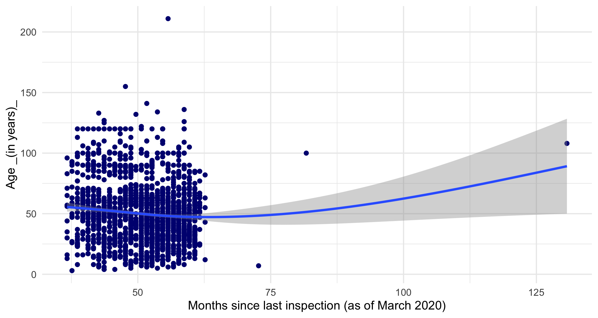
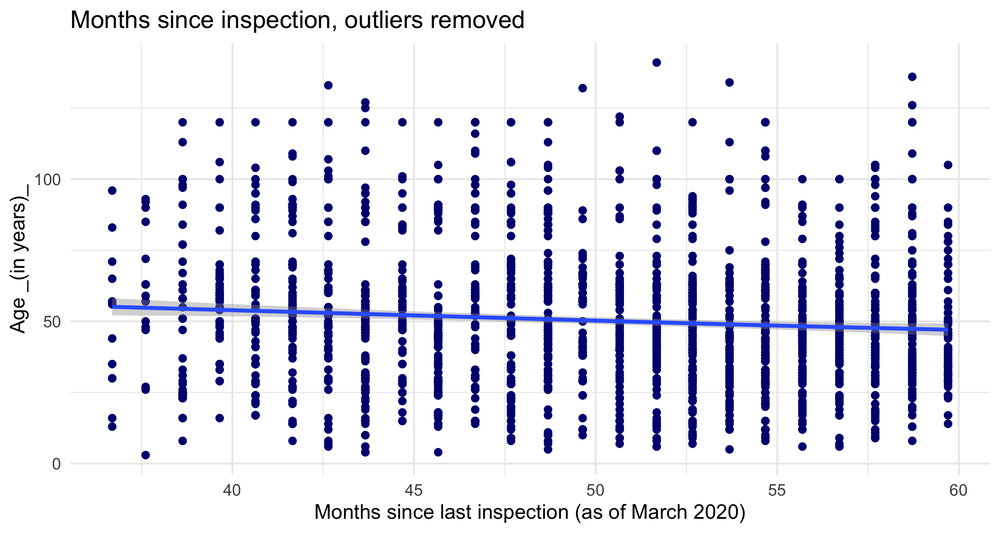

    # readin in data, create df for plots
    library(tidytuesdayR) # to load tidytuesday data
    library(tidyverse) # to do tidyverse things
    library(tidylog) # to get a log of what's happening to the data
    library(RColorBrewer) # colors!
    library(scales) # format chart output
    library(lubridate) # dates!

Read in raw data, get it ready for analysis

    today <- as.Date(c("2020-03-21"))
    #Sys.Date()
    today_yr <- as.numeric(format(today, format="%Y"))

    tt_balt_gh <-
    read_csv("https://raw.githubusercontent.com/rfordatascience/tidytuesday/master/data/2018/2018-11-27/baltimore_bridges.csv")

    tt_baltdf <- as.data.frame(tt_balt_gh) %>%
      mutate(age = today_yr - yr_built) %>%
      #  mutate(vehicles_n = as.numeric(str_remove(vehicles, " vehicles")))
      ## not needed, avg_daily_traffic has same info
      mutate(inspection_yr = inspection_yr + 2000) %>%
      mutate(county = ifelse(county == "Baltimore city", "Baltimore City", county)) %>% 
      mutate(county = str_replace(county, " County", "")) %>%
      mutate(bridge_condition = factor(bridge_condition, levels = c("Good", "Fair", "Poor"))) %>%
      mutate(decade_built = case_when(yr_built <= 1899 ~ "pre 1900", 
                                      yr_built >= 1900 & yr_built <1910 ~ "1900-09",
                                      yr_built >= 1910 & yr_built <1920 ~ "1910-19",
                                      yr_built >= 1920 & yr_built <1930 ~ "1920-29",
                                      yr_built >= 1930 & yr_built <1940 ~ "1930-39",
                                      yr_built >= 1940 & yr_built <1950 ~ "1940-49",
                                      yr_built >= 1950 & yr_built <1960 ~ "1950-59",
                                      yr_built >= 1960 & yr_built <1970 ~ "1960-69",
                                      yr_built >= 1970 & yr_built <1980 ~ "1970-79",
                                      yr_built >= 1980 & yr_built <1990 ~ "1980-89",
                                      yr_built >= 1990 & yr_built <2000 ~ "1990-99",
                                      yr_built >= 2000 & yr_built <2010 ~ "2000-09",
                                      TRUE ~ "2010-19")) %>%
      mutate(decade_built = factor(decade_built, levels = 
                                     c("pre 1900", "1900-09", "1910-19", "1920-29", "1930-39",
                                       "1940-49", "1950-59", "1960-69", "1970-79", 
                                       "1980-89", "1990-99", "2000-09", "2010-19"))) %>%
      mutate(inspect_mmyy = ISOdate(year = inspection_yr, month = inspection_mo, day = "01")) %>%
      mutate(inspect_mmyy = as.Date(inspect_mmyy, "%m/%d/%y")) %>%
      mutate(inspect_days = today - inspect_mmyy) %>%
      mutate(inspect_daysn = as.numeric(inspect_days)) %>%
      mutate(inspect_years = inspect_daysn/ 365.25) %>%
      mutate(inspect_months = inspect_daysn / 30.417)

### First few charts look at bridges built by decade, the condition of all bridges by county, and how long since last inspection

    tt_baltdf %>% 
      mutate(county = str_replace(county, " County", "")) %>%
      count(decade_built) %>%
      ggplot(aes(decade_built, n)) +
      geom_bar(stat = "identity", fill = "navy") +
      geom_text(aes(label = n), color = "white", vjust = 1.2) +
      labs(title = "Bridges built by decade" ,
            x = "", y = "") +
      theme_minimal() +
      theme(panel.grid.major = element_blank(), panel.grid.minor = element_blank())

    ## percent bridge condition by county
    # need to create df object to do subset label call in bar chart
    brcondcty <- 
    tt_baltdf %>%
      count(county, bridge_condition) %>%
      group_by(county) %>%
      mutate(pct = n / sum(n)) %>%
      ungroup() 

    ggplot(brcondcty, aes(x = county, y = pct, fill = bridge_condition)) +
      geom_bar(stat = "identity") +
      geom_text(data = subset(brcondcty, bridge_condition != "Poor"), 
                aes(label = percent(pct)), position = "stack", 
                color= "#585858", vjust = 1, size = 3.5) +
      scale_y_continuous(label = percent_format()) +
      labs(title = "Percent bridge condition by county" , 
            x = "", y = "", fill = "Bridge Condition") +
      scale_fill_brewer(type = "seq", palette = "Blues") +
      theme_minimal() +
      theme(panel.grid.major = element_blank(), panel.grid.minor = element_blank())

    ## median age of bridges by county
    tt_baltdf %>%
      group_by(county) %>%
      summarise(medage = median(age)) %>%
      ungroup() %>%
      ggplot(aes(x = county, y = medage)) +
      geom_bar(stat = "identity", fill= "navy") +
      geom_text(aes(label = round(medage, digits = 1)), 
                size = 5, color = "white", vjust = 1.6) +
      ylim(0, 60) +
      labs(title = "Median bridge age by county" , 
            x = "", y = "") +
      theme_minimal() +
      theme(panel.grid.major = element_blank(), panel.grid.minor = element_blank())

    ## median months since last inspection by county
    tt_baltdf %>%
      group_by(county) %>%
      summarise(medinsp = median(inspect_months)) %>%
      ungroup() %>%
      ggplot(aes(x = county, y = medinsp)) +
      geom_bar(stat = "identity", fill= "navy") +
      geom_text(aes(label = round(medinsp, digits = 1)), 
                size = 5, color = "white", vjust = 1.6) +
      ylim(0, 60) +
      labs(title = "Median months since last inspection, by county" , 
           x = "", y = "") +
      theme_minimal() +
      theme(panel.grid.major = element_blank(), panel.grid.minor = element_blank())

    ## median & interquartile months since last inspection by county
    tt_baltdf %>%
      group_by(county) %>%
      summarise(medmths = median(inspect_months),
                lq = quantile(inspect_months, 0.25),
                uq = quantile(inspect_months, 0.75)) %>%
      ungroup() %>%
      ggplot(aes(county, medmths)) +
      geom_linerange(aes(ymin = lq, ymax = uq), size = 2, color = "navy") +
      geom_point(size = 3, color = "orange", alpha = .8) +
      geom_text(aes(label = round(medmths, digits = 1)), 
                size = 4, color = "orange", hjust = 1.2) +
      geom_text(aes(y = uq, label = round(uq, digits = 0)), 
                size = 4, color = "navy", hjust = 1.2) +
      geom_text(aes(y = lq, label = round(lq, digits = 0)), 
                size = 4, color = "navy", hjust = 1.2) +
      ylim(0, 60) +
      labs(title = "Median & interquartile months since last inspection, by county" , 
           x = "", y = "") +
      theme_minimal() +
      theme(panel.grid.major = element_blank(), panel.grid.minor = element_blank())

    ## age by months since last inspection
    tt_baltdf %>%
      ggplot(aes(inspect_months, age)) +
      geom_point(color = "navy") +
      geom_smooth() +
      labs(x = "Months since last inspection (from current date)",
           y = "Age (in years)") +
      theme_minimal()

     # same but outliers removed
    tt_baltdf %>%
      filter(age <150, inspect_months <60) %>%
      ggplot(aes(inspect_months, age)) +
      geom_point(color = "navy") +
      geom_smooth() +
      labs(title = "Months since inspection, outliers removed", 
           x = "Months since last inspection (from current date)",
           y = "Age (in years)") +
      theme_minimal()

    ## age by months since last inspection, by county
    tt_baltdf %>%
      ggplot(aes(inspect_months, age, color = county)) +
      geom_point() +
      scale_color_brewer(palette="Dark2") +
      labs(title = "Months since last inspection (from current date)", 
           x = "Months since last inspection (from current date)",
           y = "Age (in years)") +
      theme_minimal() +
      theme(legend.position = c(.8, .95),
            legend.justification = c("right", "top"),
            legend.box.just = "right",
            legend.margin = margin(6, 6, 6, 6))

    ## median of daily riders of bridges by county - 
        # note reorder w/out - before y to sort by top avgtraf
    tt_baltdf %>%
      group_by(county) %>%
      summarise(medtraf = median(avg_daily_traffic)) %>%
      ungroup() %>%
      ggplot(aes(reorder((county), medtraf), medtraf)) +
      geom_bar(stat = "identity", fill= "navy") +
      geom_text(aes(label = comma(round(medtraf, digits = 0))), color = "white", hjust = 1.2) +
      scale_y_continuous(label = comma) +
      labs(title = "Median of average daily bridge traffic, by county" ,
            x = "", y = "") +
      coord_flip() +
      theme_minimal() +
      theme(panel.grid.major = element_blank(), panel.grid.minor = element_blank())

    # median & interquartiles of daily riders of bridges by county -
    tt_baltdf %>%
      group_by(county) %>%
      summarise(medtraf = median(avg_daily_traffic),
                lq = quantile(avg_daily_traffic, 0.25),
                uq = quantile(avg_daily_traffic, 0.75)) %>%
      ungroup() %>%
      ggplot(aes(county, medtraf)) +
      geom_linerange(aes(ymin = lq, ymax = uq), size = 2, color = "navy") +
      geom_point(size = 3, color = "orange", alpha = .8) +
      geom_text(aes(label = comma(medtraf, digits = 0)), 
                size = 4, color = "orange", hjust = 1.2) +
      geom_text(aes(y = uq, label = comma(uq, digits = 0)), 
                size = 4, color = "navy", hjust = 1.2) +
      geom_text(aes(y = lq, label = comma(lq, digits = 0)), 
                size = 4, color = "navy", hjust = 1.2) +
      scale_y_continuous(label = comma) +
      labs(title = "Median & interquartile ranges of average daily riders per bridge, by county" , 
           x = "", y = "") +
      theme_minimal() +
      theme(panel.grid.major = element_blank(), panel.grid.minor = element_blank())

    ## age by avg daily riders by county
    tt_baltdf %>%
      ggplot(aes(avg_daily_traffic, age, color = county)) +
      geom_point() +
      scale_color_brewer(palette="Dark2") +
      scale_x_continuous(labels = comma) +
      labs(title = "Average daily traffic per bridge, by county" , 
            x = "Average daily traffic",
           y = "Age (in years)") +
      theme_minimal() +
      theme(legend.position = c(.75, .95),
            legend.justification = c("right", "top"),
            legend.box.just = "right",
            legend.margin = margin(6, 6, 6, 6))

