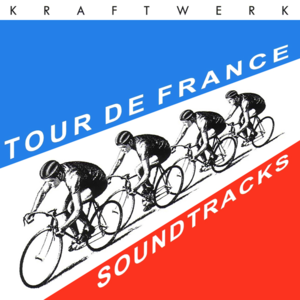

*Work in progress*
------------------

### [Tidy Tuesday](https://github.com/rfordatascience/tidytuesday) for [April 7, 2020](https://github.com/rfordatascience/tidytuesday/tree/master/data/2020/2020-04-07), a trove of data on [The Tour de France](https://www.letour.fr/en/).

    # load packages
    library(tidytuesdayR) # to load tidytuesday data
    library(tidyverse) # to do tidyverse things
    library(tidylog) # to get a log of what's happening to the data
    library(tdf) # to get original stag results file

    #library(patchwork) # stitch plots together
    #library(gt) # lets make tables
    #library(RColorBrewer) # colors!
    #library(scales) # format chart output

    # create notin operator to help with cleaning & analysis
    `%notin%` <- negate(`%in%`)

There’s a ton of data here, sourced from the [`tdf` package from
Alastair Rushworth](https://github.com/alastairrushworth/tdf) and
(Thomas Camminady’s data set)
(<a href="https://github.com/camminady/LeTourDataSet" class="uri">https://github.com/camminady/LeTourDataSet</a>),
via
[Kaggle](https://www.kaggle.com/jaminliu/a-brief-tour-of-tour-de-france-in-numbers/)

There are three distinct sets to work thru, each going back to the first
run of the race in 1903:  
\* A dataframe of overall ([General Classification, or Yellow Jersey /
*maillot
jaune*](https://en.wikipedia.org/wiki/General_classification_in_the_Tour_de_France))
winners from 1903 to 2019 comes from the Tidy Tuesday frame.  
\* A dataframe with stage winners for races 1903 to 2017, also in the
Tidy Tuesday set, sourced from Kaggle.  
\* A frame of overall stage results, sourced from the `tdf` pacakge due
to issues with date conversion in the data included in the Tidy Tuesday
set.

The stage winner set needs a bit of mungung…I created a
stage\_results\_id column similar to the one in the stage results set.
But it needs leading zeros for stages 1-9 so it sorts properly.

    # load main file from tt repo
    tt_tdf <- tidytuesdayR::tt_load('2020-04-07')
    #> 
    #>  Downloading file 1 of 3: `stage_data.csv`
    #>  Downloading file 2 of 3: `tdf_stages.csv`
    #>  Downloading file 3 of 3: `tdf_winners.csv`

    # create race winners set. comes from tdf package. includes up to 2019
    tdf_winners <- as_tibble(tt_tdf$tdf_winners)
    glimpse(tdf_winners)
    #> Rows: 106
    #> Columns: 19
    #> $ edition       <dbl> 1, 2, 3, 4, 5, 6, 7, 8, 9, 10, 11, 12, 13, 14, 15, 16, …
    #> $ start_date    <date> 1903-07-01, 1904-07-02, 1905-07-09, 1906-07-04, 1907-0…
    #> $ winner_name   <chr> "Maurice Garin", "Henri Cornet", "Louis Trousselier", "…
    #> $ winner_team   <chr> "La Française", "Conte", "Peugeot–Wolber", "Peugeot–Wol…
    #> $ distance      <dbl> 2428, 2428, 2994, 4637, 4488, 4497, 4498, 4734, 5343, 5…
    #> $ time_overall  <dbl> 94.55389, 96.09861, NA, NA, NA, NA, NA, NA, NA, NA, 197…
    #> $ time_margin   <dbl> 2.98916667, 2.27055556, NA, NA, NA, NA, NA, NA, NA, NA,…
    #> $ stage_wins    <dbl> 3, 1, 5, 5, 2, 5, 6, 4, 2, 3, 1, 1, 1, 4, 2, 0, 3, 4, 4…
    #> $ stages_led    <dbl> 6, 3, 10, 12, 5, 13, 13, 3, 13, 13, 8, 15, 2, 14, 14, 3…
    #> $ height        <dbl> 1.62, NA, NA, NA, NA, NA, 1.78, NA, NA, NA, NA, NA, NA,…
    #> $ weight        <dbl> 60, NA, NA, NA, NA, NA, 88, NA, NA, NA, NA, NA, NA, NA,…
    #> $ age           <dbl> 32, 19, 24, 27, 24, 25, 22, 22, 26, 23, 23, 24, 33, 30,…
    #> $ born          <date> 1871-03-03, 1884-08-04, 1881-06-29, 1879-06-05, 1882-1…
    #> $ died          <date> 1957-02-19, 1941-03-18, 1939-04-24, 1907-01-25, 1917-1…
    #> $ full_name     <chr> NA, NA, NA, NA, "Lucien Georges Mazan", "Lucien Georges…
    #> $ nickname      <chr> "The Little Chimney-sweep", "Le rigolo (The joker)", "L…
    #> $ birth_town    <chr> "Arvier", "Desvres", "Paris", "Moret-sur-Loing", "Pless…
    #> $ birth_country <chr> "Italy", "France", "France", "France", "France", "Franc…
    #> $ nationality   <chr> " France", " France", " France", " France", " France", …

    # create stage winner set. in Tidy Tuesday file, comes from kaggle, includes up to 2017
    tdf_stagewin <- tt_tdf$tdf_stages %>%
      mutate(race_year = lubridate::year(Date)) %>% 
      mutate(Stage = ifelse(Stage == "P", "0", Stage)) %>%
      mutate(stage_ltr = case_when(str_detect(Stage, "a") ~ "a",
                                   str_detect(Stage, "b") ~ "b",
                                   str_detect(Stage, "c") ~ "c",
                                   TRUE ~ "")) %>%
      mutate(stage_num = str_remove_all(Stage, "[abc]")) %>%
      mutate(stage_num = stringr::str_pad(stage_num, 2, side = "left", pad = 0)) %>% 
      mutate(stage_results_id = paste0("stage-", stage_num, stage_ltr)) %>%
      mutate(split_stage = ifelse(stage_ltr %in% c("a", "b", "c"), "yes", "no")) %>%
      select(race_year, stage_results_id, stage_date = Date, Type, split_stage,
             Origin, Destination, Distance, Winner, Winner_Country, everything())

    glimpse(tdf_stagewin)
    #> Rows: 2,236
    #> Columns: 13
    #> $ race_year        <dbl> 2017, 2017, 2017, 2017, 2017, 2017, 2017, 2017, 2017…
    #> $ stage_results_id <chr> "stage-01", "stage-02", "stage-03", "stage-04", "sta…
    #> $ stage_date       <date> 2017-07-01, 2017-07-02, 2017-07-03, 2017-07-04, 201…
    #> $ Type             <chr> "Individual time trial", "Flat stage", "Medium mount…
    #> $ split_stage      <chr> "no", "no", "no", "no", "no", "no", "no", "no", "no"…
    #> $ Origin           <chr> "Düsseldorf", "Düsseldorf", "Verviers", "Mondorf-les…
    #> $ Destination      <chr> "Düsseldorf", "Liège", "Longwy", "Vittel", "La Planc…
    #> $ Distance         <dbl> 14.0, 203.5, 212.5, 207.5, 160.5, 216.0, 213.5, 187.…
    #> $ Winner           <chr> "Geraint Thomas", "Marcel Kittel", "Peter Sagan", "A…
    #> $ Winner_Country   <chr> "GBR", "GER", "SVK", "FRA", "ITA", "GER", "GER", "FR…
    #> $ Stage            <chr> "1", "2", "3", "4", "5", "6", "7", "8", "9", "10", "…
    #> $ stage_ltr        <chr> "", "", "", "", "", "", "", "", "", "", "", "", "", …
    #> $ stage_num        <chr> "01", "02", "03", "04", "05", "06", "07", "08", "09"…

Stage data in CSV from tt repository seems to have truncated the times,
leaving only the seconds in a character field. To get complete results
we need to pull from `tdf` package using the cleaning script from the
Tidy Tuesday page. Some operations will take a while. Those parts of the
code commented out here so they don’t run while the page kints &
compiles. For analysis, I’ll load in the saved rds set.

In terms of cleaning:  
\* The stage\_results\_id & rank fields needs leading zeros. \* The rank
field needs a bit of clean-up to fix the 1000s codes.

In the process of cleaning and comparing to the stage winners set, I
noticed there were some problems in years where individual stages were
split into 2 or 3 legs (A, B & C). Either while it was scraped or
combined, the A leg results ended up repeating to the B leg, and in some
cases the C leg wasn’t reported. I put it in as an issue in the github
repo. But that shouldn’t take away from what’s an amazing dataset to
work with. In the analysis section I’ll work around the problems with
those stages.

    glimpse(tdf::editions)
    #> Rows: 106
    #> Columns: 20
    #> $ edition       <int> 1, 2, 3, 4, 5, 6, 7, 8, 9, 10, 11, 12, 13, 14, 15, 16, …
    #> $ start_date    <date> 1903-07-01, 1904-07-02, 1905-07-09, 1906-07-04, 1907-0…
    #> $ winner_name   <chr> "Maurice Garin", "Henri Cornet", "Louis Trousselier", "…
    #> $ winner_team   <chr> "La Française", "Conte", "Peugeot–Wolber", "Peugeot–Wol…
    #> $ distance      <dbl> 2428, 2428, 2994, 4637, 4488, 4497, 4498, 4734, 5343, 5…
    #> $ time_overall  <dbl> 94.55389, 96.09861, NA, NA, NA, NA, NA, NA, NA, NA, 197…
    #> $ time_margin   <dbl> 2.98916667, 2.27055556, NA, NA, NA, NA, NA, NA, NA, NA,…
    #> $ stage_wins    <dbl> 3, 1, 5, 5, 2, 5, 6, 4, 2, 3, 1, 1, 1, 4, 2, 0, 3, 4, 4…
    #> $ stages_led    <dbl> 6, 3, 10, 12, 5, 13, 13, 3, 13, 13, 8, 15, 2, 14, 14, 3…
    #> $ height        <dbl> 1.62, NA, NA, NA, NA, NA, 1.78, NA, NA, NA, NA, NA, NA,…
    #> $ weight        <dbl> 60, NA, NA, NA, NA, NA, 88, NA, NA, NA, NA, NA, NA, NA,…
    #> $ age           <int> 32, 19, 24, 27, 24, 25, 22, 22, 26, 23, 23, 24, 33, 30,…
    #> $ born          <date> 1871-03-03, 1884-08-04, 1881-06-29, 1879-06-05, 1882-1…
    #> $ died          <date> 1957-02-19, 1941-03-18, 1939-04-24, 1907-01-25, 1917-1…
    #> $ full_name     <chr> NA, NA, NA, NA, "Lucien Georges Mazan", "Lucien Georges…
    #> $ nickname      <chr> "The Little Chimney-sweep", "Le rigolo (The joker)", "L…
    #> $ birth_town    <chr> "Arvier", "Desvres", "Paris", "Moret-sur-Loing", "Pless…
    #> $ birth_country <chr> "Italy", "France", "France", "France", "France", "Franc…
    #> $ nationality   <chr> " France", " France", " France", " France", " France", …
    #> $ stage_results <named list> [[<tbl_df[37 x 7]>, <tbl_df[35 x 7]>, <tbl_df[27…

    # all_years <- tdf::editions %>% 
    #   unnest_longer(stage_results) %>% 
    #   mutate(stage_results = map(stage_results, ~ mutate(.x, rank = as.character(rank)))) %>% 
    #   unnest_longer(stage_results) 
    # 
    # stage_all <- all_years %>% 
    #   select(stage_results) %>% 
    #   flatten_df()
    # 
    # combo_df <- bind_cols(all_years, stage_all) %>% 
    #   select(-stage_results)
    # 
    # tdf_stagedata <- as_tibble(combo_df %>% 
    #   select(edition, start_date,stage_results_id:last_col()) %>% 
    #   mutate(year = lubridate::year(start_date)) %>% 
    #   rename(age = age...25) %>% 
    #   
    #   # to add leading 0 to stage, extract num, create letter, add 0s to num, paste
    #   mutate(stage_num = str_replace(stage_results_id, "stage-", "")) %>%
    #   mutate(stage_ltr = case_when(str_detect(stage_num, "a") ~ "a",
    #                                str_detect(stage_num, "b") ~ "b",
    #                                TRUE ~ ""))) %>%
    #   mutate(stage_num = str_remove_all(stage_num, "[ab]")) %>%
    #   mutate(stage_num = stringr::str_pad(stage_num, 2, side = "left", pad = 0)) %>%
    #   mutate(stage_results_id2 = paste0("stage-", stage_num, stage_ltr)) %>%
    #   mutate(split_stage = ifelse(stage_ltr %in% c("a", "b"), "yes", "no")) %>% 
    #   
    #   # fix 1000s rank. change to DNF
    #   mutate(rank = ifelse(rank %in% c("1003", "1005", "1006"), "DNF", rank)) %>%
    #   mutate(rank2 = ifelse(rank %notin% c("DF", "DNF", "DNS", "DSQ","NQ","OTL"), 
    #                         stringr::str_pad(rank, 3, side = "left", pad = 0), rank)) %>% 
    #   select(-stage_results_id, -start_date, ) %>%
    #   select(edition, year, stage_results_id = stage_results_id2, split_stage, rider, rank2, 
    #          time, elapsed, points, bib_number, team, age, everything())
    # 
    # saveRDS(tdf_stagedata, "data/tdf_stagedata.rds")

    tdf_stagedata <- readRDS("data/tdf_stagedata.rds")
    glimpse(tdf_stagedata)
    #> Rows: 255,752
    #> Columns: 14
    #> $ edition          <int> 1, 1, 1, 1, 1, 1, 1, 1, 1, 1, 1, 1, 1, 1, 1, 1, 1, 1…
    #> $ start_date       <date> 1903-07-01, 1903-07-01, 1903-07-01, 1903-07-01, 190…
    #> $ stage_results_id <chr> "stage-1", "stage-1", "stage-1", "stage-1", "stage-1…
    #> $ rank             <chr> "1", "2", "3", "4", "5", "6", "7", "8", "9", "10", "…
    #> $ time             <Period> 17H 45M 13S, 55S, 34M 59S, 1H 2M 48S, 1H 4M 53S, …
    #> $ rider            <chr> "Garin Maurice", "Pagie Émile", "Georget Léon", "Aug…
    #> $ age              <int> 32, 32, 23, 20, 36, 37, 25, 33, NA, 22, 26, 28, 21, …
    #> $ team             <chr> NA, NA, NA, NA, NA, NA, NA, NA, NA, NA, NA, NA, NA, …
    #> $ points           <int> 100, 70, 50, 40, 32, 26, 22, 18, 14, 10, 8, 6, 4, 2,…
    #> $ elapsed          <Period> 17H 45M 13S, 17H 46M 8S, 18H 20M 12S, 18H 48M 1S,…
    #> $ bib_number       <int> NA, NA, NA, NA, NA, NA, NA, NA, NA, NA, NA, NA, NA, …
    #> $ year             <dbl> 1903, 1903, 1903, 1903, 1903, 1903, 1903, 1903, 1903…
    #> $ stage_num        <chr> "1", "1", "1", "1", "1", "1", "1", "1", "1", "1", "1…
    #> $ stage_ltr        <chr> "", "", "", "", "", "", "", "", "", "", "", "", "", …

Poking around the Kaggle site referenced I found this dataset of final
results for all riders in all races since 1903. A few different fields
than in the tidy tuesday winners set.

    ## overall race results for finishers up to 2020...need to figure out how to merge with tdf package sets
    tdf_bigset <- read.csv("https://github.com/camminady/LeTourDataSet/blob/master/Riders.csv?raw=true") %>%
      mutate(Rider = str_to_title(Rider)) %>%
      rename(rownum = X)

Now this is a ton of data to work with, and I won’t use it all. Figured
I’d include the code to get it all in case you get inspired to grab it
and take a look.

Ok, let’s lok into the data and make some charts and tables.
