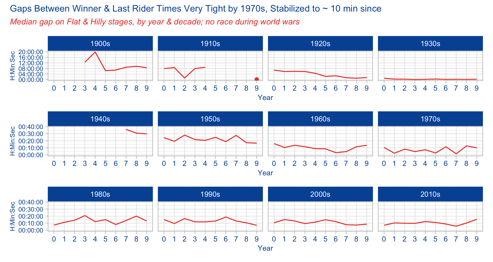

*Work in progress*
------------------

### [Tidy Tuesday](https://github.com/rfordatascience/tidytuesday) for [April 7, 2020](https://github.com/rfordatascience/tidytuesday/tree/master/data/2020/2020-04-07), a trove of data on [The Tour de France](https://www.letour.fr/en/).

This is a long post, but I put a lot of work into cleaning the data, so
left all that work in. If you just want the charts, scroll down a ways.


``` r
# load packages
library(tidytuesdayR) # to load tidytuesday data
library(tidyverse) # to do tidyverse things
library(tidylog) # to get a log of what's happening to the data
library(tdf) # to get original stage results file

library(patchwork) # stitch plots together
library(gt) # lets make tables
#library(RColorBrewer) # colors!
#library(scales) # format chart output

# create notin operator to help with cleaning & analysis
`%notin%` <- negate(`%in%`)
```

There’s a ton of data here, sourced from the [`tdf` package from
Alastair Rushworth](https://github.com/alastairrushworth/tdf) and
[Thomas Camminady’s data
set](https://github.com/camminady/LeTourDataSet), via
[Kaggle](https://www.kaggle.com/jaminliu/a-brief-tour-of-tour-de-france-in-numbers/)

There are three distinct sets to work thru, each going back to the first
run of the race in 1903:  
\* A dataframe of overall ([General Classification, or Yellow Jersey /
*maillot
jaune*](https://en.wikipedia.org/wiki/General_classification_in_the_Tour_de_France))
winners from 1903 to 2019 comes from the Tidy Tuesday frame.  
\* A dataframe with stage winners for races 1903 to 2017, also in the
Tidy Tuesday set, sourced from Kaggle.  
\* A frame of overall stage results, sourced from the `tdf` pacakge due
to issues with date conversion in the data included in the Tidy Tuesday
set.

The stage winner set needs a bit of mungung…I created a
stage\_results\_id column similar to the one in the stage results set.
But it needs leading zeros for stages 1-9 so it sorts properly.

I then got it in my head I wanted results through 2020, so I grabbed
them from wikipedia; but the hard way, with copy-paste since my scraping
skills aren’t there & I just wanted it done. Data is uploaded if you
want to use it.

``` r
# load main file from tt repo
tt_tdf <- tidytuesdayR::tt_load('2020-04-07')
#> 
#>  Downloading file 1 of 3: `stage_data.csv`
#>  Downloading file 2 of 3: `tdf_stages.csv`
#>  Downloading file 3 of 3: `tdf_winners.csv`

# create race winners set. comes from tdf package. includes up to 2019
tdf_winners <- as_tibble(tt_tdf$tdf_winners)

# create stage winner set. in tt file, comes from kaggle, includes up to 2017
tdf_stagewin1 <- tt_tdf$tdf_stages %>%
  mutate_if(is.character, str_trim)
  
# pulled 2018 - 2020 from wikipedia
# read in excel - need to separate route field to Origin & Destination
tdf_stagewin2 <- readxl::read_excel("data/tdf_stagewinners_2018-20.xlsx") %>%
  mutate(Stage = as.character(Stage)) %>%
  mutate(Date = lubridate::as_date(Date)) %>% 
  separate(Course, c("Origin", "Destination"), "to", extra = "merge") %>%
  mutate_if(is.character, str_trim) %>%
  select(Stage, Date, Distance, Origin, Destination, Type, Winner, Winner_Country = Winner_country)

# join with rbind (since I made sure to put 2018-2020 data in same shape as tt set)
# clean up a bit
tdf_stagewin <- rbind(tdf_stagewin1, tdf_stagewin2) %>%
  mutate(race_year = lubridate::year(Date)) %>% 
  mutate(Stage = ifelse(Stage == "P", "0", Stage)) %>%
  mutate(stage_ltr = case_when(str_detect(Stage, "a") ~ "a",
                               str_detect(Stage, "b") ~ "b",
                               str_detect(Stage, "c") ~ "c",
                               TRUE ~ "")) %>%
  mutate(stage_num = str_remove_all(Stage, "[abc]")) %>%
  mutate(stage_num = stringr::str_pad(stage_num, 2, side = "left", pad = 0)) %>% 
  mutate(stage_results_id = paste0("stage-", stage_num, stage_ltr)) %>%
  mutate(split_stage = ifelse(stage_ltr %in% c("a", "b", "c"), "yes", "no")) %>%
  
  # extract first and last names from winner field
  mutate(winner_first = str_match(Winner, "(^.+)\\s")[, 2]) %>%
  mutate(winner_last= gsub(".* ", "", Winner)) %>%

  # clean up stage type
  mutate(stage_type = case_when(Type %in% c("Flat cobblestone stage", "Flat stage", "Flat",
                                            "Flat Stage", "Hilly stage", "Plain stage", 
                                            "Plain stage with cobblestones") 
                                ~ "Flat / Plain / Hilly",
                                Type %in% c("High mountain stage", "Medium mountain stage",
                                            "Mountain stage", "Mountain Stage", "Stage with mountain",
                                            "Stage with mountain(s)", "Transition stage")
                                ~ "Mountain",
                                Type %in% c("Individual time trial", "Mountain time trial") 
                                ~ "Time Trial - Indiv",
                                Type == "Team time trial" ~ "Time Trial - Team",
                                TRUE ~ "Other")) %>% 
  mutate_if(is.character, str_trim) %>%
  arrange(desc(race_year), stage_results_id) %>%
  select(race_year, stage_results_id, stage_date = Date, stage_type, Type, split_stage,
         Origin, Destination, Distance, Winner, winner_first, winner_last,
         Winner_Country, everything())

# take a look at this awesome dataset
glimpse(tdf_stagewin)
#> Rows: 2,299
#> Columns: 16
#> $ race_year        <dbl> 2020, 2020, 2020, 2020, 2020, 2020, 2020, 2020, 2020…
#> $ stage_results_id <chr> "stage-01", "stage-02", "stage-03", "stage-04", "sta…
#> $ stage_date       <date> 2020-08-29, 2020-08-30, 2020-08-31, 2020-09-01, 202…
#> $ stage_type       <chr> "Flat / Plain / Hilly", "Mountain", "Flat / Plain / …
#> $ Type             <chr> "Flat stage", "Medium mountain stage", "Flat stage",…
#> $ split_stage      <chr> "no", "no", "no", "no", "no", "no", "no", "no", "no"…
#> $ Origin           <chr> "Nice", "Nice", "Nice", "Sisteron", "Gap", "Le Teil"…
#> $ Destination      <chr> "Nice", "Nice", "Sisteron", "Orcières-Merlette", "Pr…
#> $ Distance         <dbl> 156.0, 186.0, 198.0, 160.5, 183.0, 191.0, 168.0, 141…
#> $ Winner           <chr> "Alexander Kristoff", "Julian Alaphilippe", "Caleb E…
#> $ winner_first     <chr> "Alexander", "Julian", "Caleb", "Primož", "Wout van"…
#> $ winner_last      <chr> "Kristoff", "Alaphilippe", "Ewan", "Roglič", "Aert",…
#> $ Winner_Country   <chr> "NOR", "FRA", "AUS", "SLO", "BEL", "KAZ", "BEL", "FR…
#> $ Stage            <chr> "1", "2", "3", "4", "5", "6", "7", "8", "9", "10", "…
#> $ stage_ltr        <chr> "", "", "", "", "", "", "", "", "", "", "", "", "", …
#> $ stage_num        <chr> "01", "02", "03", "04", "05", "06", "07", "08", "09"…
```

Stage data in CSV from tt repository seems to have truncated the times,
leaving only the seconds in a character field. To get complete results
we need to pull from `tdf` package using the cleaning script from the
Tidy Tuesday page. Some operations will take a while. Those parts of the
code commented out here so they don’t run while the page kints &
compiles. For analysis, I’ll load in the saved rds set.

In terms of cleaning:  
\* The stage\_results\_id & rank fields needs leading zeros.  
\* The rank field needs a bit of clean-up to fix the 1000s codes.  
\* Since rider names were last-first, I wanted to separate out first and
last, and also make a field with the full name, but first name in front.
Stackoverlflow was my regex friend here.  
\* Other minor fixes

In the process of cleaning and comparing to the stage winners set, I
noticed there were some problems in years where individual stages were
split into 2 or 3 legs (A, B & C). Either while it was scraped or
combined, the A leg results ended up repeating to the B leg, and in some
cases the C leg wasn’t reported. I put it in as an issue in the github
repo. But that shouldn’t take away from what’s an amazing dataset to
work with. In the analysis section I’ll work around the problems with
those stages.

``` r

# all_years <- tdf::editions %>% 
#   unnest_longer(stage_results) %>% 
#   mutate(stage_results = map(stage_results, ~ mutate(.x, rank = as.character(rank)))) %>% 
#   unnest_longer(stage_results) 
# 
# stage_all <- all_years %>% 
#   select(stage_results) %>% 
#   flatten_df()
# 
# combo_df <- bind_cols(all_years, stage_all) %>% 
#   select(-stage_results)
# 
# tdf_stagedata <- as_tibble(combo_df %>% 
#   select(edition, start_date,stage_results_id:last_col()) %>% 
#   mutate(race_year = lubridate::year(start_date)) %>% 
#   rename(age = age...25) %>% 
#   
#   # to add leading 0 to stage, extract num, create letter, add 0s to num, paste
#   mutate(stage_num = str_replace(stage_results_id, "stage-", "")) %>%
#   mutate(stage_ltr = case_when(str_detect(stage_num, "a") ~ "a",
#                                str_detect(stage_num, "b") ~ "b",
#                                TRUE ~ ""))) %>%
#   mutate(stage_num = str_remove_all(stage_num, "[ab]")) %>%
#   mutate(stage_num = stringr::str_pad(stage_num, 2, side = "left", pad = 0)) %>%
#   mutate(stage_results_id2 = paste0("stage-", stage_num, stage_ltr)) %>%
#   mutate(split_stage = ifelse(stage_ltr %in% c("a", "b"), "yes", "no")) %>% 
#   
#   # fix 1000s rank. change to DNF
#   mutate(rank = ifelse(rank %in% c("1003", "1005", "1006"), "DNF", rank)) %>%
#   mutate(rank2 = ifelse(rank %notin% c("DF", "DNF", "DNS", "DSQ","NQ","OTL"), 
#                         stringr::str_pad(rank, 3, side = "left", pad = 0), rank)) %>% 
#   
#   # extract first and last names from rider field
#   mutate(rider_last = str_match(rider, "(^.+)\\s")[, 2]) %>%
#   mutate(rider_first= gsub(".* ", "", rider)) %>%
#   mutate(rider_firstlast = paste0(rider_first, " ", rider_last)) %>%
#   select(-stage_results_id, -start_date, ) %>%
#   
#   # fix 1967 & 1968
#   mutate(stage_results_id2 = ifelse((race_year %in% c(1967, 1968) & stage_results_id2 == "stage-00"),
#          "stage-01a", stage_results_id2)) %>%
#   mutate(stage_results_id2 = ifelse((race_year %in% c(1967, 1968) & stage_results_id2 == "stage-01"),
#          "stage-01b", stage_results_id2)) %>%
#   mutate(split_stage = ifelse((race_year %in% c(1967, 1968) & 
#                                  stage_results_id2 %in% c("stage-01a", "stage-01b")), 
#                               "yes", split_stage)) %>%
#   
#   select(edition, race_year, stage_results_id = stage_results_id2, split_stage, 
#          rider, rider_first, rider_last, rider_firstlast, rank2, 
#          time, elapsed, points, bib_number, team, age, everything())
# 
# saveRDS(tdf_stagedata, "data/tdf_stagedata.rds")

tdf_stagedata <- readRDS("data/tdf_stagedata.rds")
glimpse(tdf_stagedata)
#> Rows: 255,752
#> Columns: 18
#> $ edition          <int> 1, 1, 1, 1, 1, 1, 1, 1, 1, 1, 1, 1, 1, 1, 1, 1, 1, 1…
#> $ race_year        <dbl> 1903, 1903, 1903, 1903, 1903, 1903, 1903, 1903, 1903…
#> $ stage_results_id <chr> "stage-01", "stage-01", "stage-01", "stage-01", "sta…
#> $ split_stage      <chr> "no", "no", "no", "no", "no", "no", "no", "no", "no"…
#> $ rider            <chr> "Garin Maurice", "Pagie Émile", "Georget Léon", "Aug…
#> $ rider_first      <chr> "Maurice", "Émile", "Léon", "Fernand", "Jean", "Marc…
#> $ rider_last       <chr> "Garin", "Pagie", "Georget", "Augereau", "Fischer", …
#> $ rider_firstlast  <chr> "Maurice Garin", "Émile Pagie", "Léon Georget", "Fer…
#> $ rank2            <chr> "001", "002", "003", "004", "005", "006", "007", "00…
#> $ time             <Period> 17H 45M 13S, 55S, 34M 59S, 1H 2M 48S, 1H 4M 53S, …
#> $ elapsed          <Period> 17H 45M 13S, 17H 46M 8S, 18H 20M 12S, 18H 48M 1S,…
#> $ points           <int> 100, 70, 50, 40, 32, 26, 22, 18, 14, 10, 8, 6, 4, 2,…
#> $ bib_number       <int> NA, NA, NA, NA, NA, NA, NA, NA, NA, NA, NA, NA, NA, …
#> $ team             <chr> NA, NA, NA, NA, NA, NA, NA, NA, NA, NA, NA, NA, NA, …
#> $ age              <int> 32, 32, 23, 20, 36, 37, 25, 33, NA, 22, 26, 28, 21, …
#> $ rank             <chr> "1", "2", "3", "4", "5", "6", "7", "8", "9", "10", "…
#> $ stage_num        <chr> "01", "01", "01", "01", "01", "01", "01", "01", "01"…
#> $ stage_ltr        <chr> "", "", "", "", "", "", "", "", "", "", "", "", "", …
```

Poking around the Kaggle site referenced I found this dataset of final
results for all riders in all races since 1903. A few different fields
than in the tidy tuesday winners set.

``` r
## overall race results for finishers up to 2020...need to figure out how to merge with tdf package sets
tdf_bigset <- read.csv("https://github.com/camminady/LeTourDataSet/blob/master/Riders.csv?raw=true") %>%
  mutate(Rider = str_to_title(Rider)) %>%
  rename(rownum = X)
```

Now this is a ton of data to work with, and I won’t use it all. Figured
I’d include the code to get it all in case you get inspired to grab it
and take a look.

Ok, let’s look into the data and make some charts and tables. Because
there’s already been a fair amount of [\#tidytuesday twitter
submissions](https://twitter.com/search?q=%23TidyTuesday%20tour%20de%20france&src=typed_query&f=live)
on the set, I don’t want to repeat what’s already there. So to start
with let’s focus on changes over time in how fast stages have been
relative to stage type and the gaps between winners and the rest of the
field. I also want to look at which riders rode the most stages, who had
the general best stage placings, and common namnes for stage winners
among other things.

First we merge stage data and stage winner data for full range of
fields. We’ll keep all records as some split stages don’t have all
correct results and/or duped results. We’ll sort this out during
analysis.

``` r
tdf_stageall <- merge(tdf_stagedata, tdf_stagewin, by.x = c("race_year", "stage_results_id"),
                      by.y = c("race_year", "stage_results_id"), all = T)
```

This set has many columns that we’ll build off of to use in analysis
going forward. To get the changes in gaps by stage types, we’ll build
another set. Because we want to look both at changes in stage types and
gaps between winners and the field, the trick here is to sort out for
each stage in each race year who the winners are (easy), who has the
slwest time (mostly easy) and who has the 2nd best record time.

That last item it tough. Why? Well in bike races like the Tour, the same
time is recorded to all riders who finish within an identifiable group.
Now each rider with that time will have a rank according to the order
they crossed the line. But it’s entirely possible for 10-20 riders (even
more in sprint finishes) to have the same time even as they’re ranked
1-20. The script below is commented to show why I did what I did. Much
of the code comes from looking at the data and seeing errors, issues,
etc. Not including that code here. Also, much of my ability to spot
errors comes from knowledge about the race, how it’s timed, some
history. Domain knowledge helps a lot when cleaning & analyzing data.

``` r
stage_gap <-
tdf_stageall %>%
  arrange(race_year, stage_results_id, rank2) %>%
  #  delete 1995 stage 16 - neutralized due to death in stage 15, all times the same
  mutate(out = ifelse((race_year == 1995 & stage_results_id == "stage-16"),
                       "drop", "keep")) %>%
  filter(out != "drop") %>%
  # delete  missing times
  filter(!is.na(time)) %>%
  # remove non-finishers/starters, change outside time limit rank to numeric to keep in set
  filter(rank %notin% c("DF", "DNF", "DNS", "DSQ", "NQ")) %>%
  filter(!is.na(rank)) %>%

  # OTLs are ejected from the race because they finished outside a time limit. But we need them in the set.
  mutate(rank_clean = case_when(rank == "OTL" ~ "999",
                           TRUE ~ rank)) %>% 
  # sortable rank field
  mutate(rank_n = as.integer(rank_clean)) %>%
  # creates total time in minutes as numeric, round it to 2 digits
  mutate(time_minutes = ifelse(!is.na(elapsed),
                              day(elapsed)*1440 + hour(elapsed)*60 + minute(elapsed) + second(elapsed)/60,
                               NA)) %>%
  mutate(time_minutes = round(time_minutes, 2)) %>%
  
  # create field for difference from winner
  group_by(race_year, stage_results_id) %>% 
  arrange(race_year, stage_results_id, time_minutes, rank2) %>%

  mutate(time_diff = time_minutes - min(time_minutes)) %>%
  mutate(time_diff_secs = time_diff*60) %>%
  mutate(time_diff = round(time_diff, 2)) %>%
  mutate(time_diff_secs = round(time_diff_secs, 0)) %>%
  mutate(time_diff_period = seconds_to_period(time_diff_secs)) %>%
  mutate(rank_mins = rank(time_minutes, ties.method = "first")) %>%
  # create rank field to use to select winner, next best, last
  mutate(compare_grp = case_when(rank_n == 1 ~ "Winner",
                                 (rank_n > 1 & time_diff_secs > 0 & rank_mins != max(rank_mins))
                                 ~ "Next best2",
                                  rank_mins == max(rank_mins) ~ "Last",
                                 TRUE ~ "Other")) %>%
  ungroup() %>%
  group_by(race_year, stage_results_id, compare_grp) %>% 
  arrange(race_year, stage_results_id, rank_mins) %>%
  mutate(compare_grp = ifelse((compare_grp == "Next best2" & rank_mins == min(rank_mins)),
                               "Next best", compare_grp)) %>%
  mutate(compare_grp = ifelse(compare_grp == "Next best2", "Other", compare_grp)) %>%
  ungroup() %>%
  mutate(compare_grp = factor(compare_grp, levels = c("Winner", "Next best", "Last", "Other"))) %>%
  # create race decade field
  mutate(race_decade = floor(race_year / 10) * 10) %>%
  mutate(race_decade = as.character(paste0(race_decade, "s"))) %>%
  # keep only winner, next, last
  filter(compare_grp != "Other") %>%
  select(race_year, race_decade, stage_results_id, stage_type, rider_firstlast, bib_number, Winner_Country,
         rank, rank_clean, rank_n, time, elapsed, time_minutes, time_diff, time_diff_secs, time_diff_period, 
         rank_mins, compare_grp) 

glimpse(stage_gap)
#> Rows: 6,673
#> Columns: 18
#> $ race_year        <dbl> 1903, 1903, 1903, 1903, 1903, 1903, 1903, 1903, 1903…
#> $ race_decade      <chr> "1900s", "1900s", "1900s", "1900s", "1900s", "1900s"…
#> $ stage_results_id <chr> "stage-01", "stage-01", "stage-01", "stage-02", "sta…
#> $ stage_type       <chr> "Flat / Plain / Hilly", "Flat / Plain / Hilly", "Fla…
#> $ rider_firstlast  <chr> "Maurice Garin", "Émile Pagie", "Pierre Desvages", "…
#> $ bib_number       <int> NA, NA, NA, NA, NA, NA, NA, NA, NA, NA, NA, NA, NA, …
#> $ Winner_Country   <chr> "FRA", "FRA", "FRA", "FRA", "FRA", "FRA", "FRA", "FR…
#> $ rank             <chr> "1", "2", "36", "1", "3", "32", "1", "2", "27", "1",…
#> $ rank_clean       <chr> "1", "2", "36", "1", "3", "32", "1", "2", "27", "1",…
#> $ rank_n           <int> 1, 2, 36, 1, 3, 32, 1, 2, 27, 1, 2, 30, 1, 4, 22, 1,…
#> $ time             <Period> 17H 45M 13S, 55S, 12H 30M 44S, 14H 28M 53S, 26M 6…
#> $ elapsed          <Period> 17H 45M 13S, 17H 46M 8S, 1d 6H 15M 57S, 14H 28M 5…
#> $ time_minutes     <dbl> 1065.22, 1066.13, 1815.95, 868.88, 894.98, 1691.87, …
#> $ time_diff        <dbl> 0.00, 0.91, 750.73, 0.00, 26.10, 822.99, 0.00, 32.36…
#> $ time_diff_secs   <dbl> 0, 55, 45044, 0, 1566, 49379, 0, 1942, 34914, 0, 243…
#> $ time_diff_period <Period> 0S, 55S, 12H 30M 44S, 0S, 26M 6S, 13H 42M 59S, 0S…
#> $ rank_mins        <int> 1, 2, 37, 1, 3, 35, 1, 2, 27, 1, 2, 30, 1, 4, 22, 1,…
#> $ compare_grp      <fct> Winner, Next best, Last, Winner, Next best, Last, Wi…
```

Ok, finally, let’s see what this data looks like. First a chart to show
averages and quartile ranges for the gaps by stage type. Create a data
object with the values, then the plots. Faceting by stage type didn’t
work because the y axis ranges were very different. So we’ll use
`patchwork` to stitch them together in one plot. The medians are the red
dots, interquartile ranges at either end of the line, and means are in
black. I included both means & medians because the spread for some stage
types was so great.

``` r
gapranges <- stage_gap %>%
  filter(compare_grp != "Winner") %>%
  filter(stage_type %notin% c("Other", "Time Trial - Team")) %>%
  group_by(stage_type, compare_grp) %>%
  summarise(num = n(), 
            lq = quantile(time_diff_secs, 0.25),
            medgap = median(time_diff_secs),
            uq = quantile(time_diff_secs, 0.75),
            lq_tp = (seconds_to_period(quantile(time_diff_secs, 0.25))),
            medgap_tp = (seconds_to_period(median(time_diff_secs))),
            uq_tp = (seconds_to_period(quantile(time_diff_secs, 0.75))),
            avggap = round(mean(time_diff_secs),2),
            avggap_tp = round(seconds_to_period(mean(time_diff_secs)), 2))

gapplot1 <-
gapranges %>%
  filter(compare_grp == "Next best") %>%
  ggplot(aes(stage_type, medgap, color = avggap)) +
  geom_linerange(aes(ymin = lq, ymax = uq), size = 2, color = "#0055A4") +
  geom_point(size = 2, color = "#EF4135") +
  geom_point(aes(y = avggap), size = 2, color = "black", alpha = .8) +
  geom_text(aes(label = medgap_tp), 
            size = 3, color = "#EF4135", hjust = 1.2) +
  geom_text(aes(y = uq, label = uq_tp), 
            size = 3, color = "#0055A4", hjust = 1.2) +
  geom_text(aes(y = lq, label = lq_tp), 
            size = 3, color = "#0055A4", hjust = 1.2) +
  geom_text(aes(label = avggap_tp, y = avggap_tp),
            size = 3, color = "black", alpha = .8, hjust = -.1) +
  labs(title = "Time Gap from Stage Winner to Next Best Time",
       subtitle = "Median & Inter-quartile Ranges (avg in black)",
       y = "Time Gap from Winner", x = "Stage Type") +
  theme_light() +
  theme(plot.title = element_text(color = "#0055A4", size = 9),
        plot.subtitle = element_text(face = "italic", color = "#EF4135",
                                     size = 8),
        axis.title.x = element_text(color = "#0055A4"),
        axis.title.y = element_text(color = "#0055A4"), 
        axis.text.x = element_text(color = "#0055A4"),
        axis.text.y=element_blank())

gapplot2 <-
gapranges %>%
  filter(compare_grp == "Last") %>%
  ggplot(aes(stage_type, medgap, color = avggap)) +
  geom_linerange(aes(ymin = lq, ymax = uq), size = 2, color = "#0055A4") +
  geom_point(size = 2, color = "#EF4135") +
  geom_point(aes(y = avggap), size = 2, color = "black", alpha = .8) +
  geom_text(aes(label = medgap_tp), 
            size = 3, color = "#EF4135", hjust = 1.2) +
  geom_text(aes(y = uq, label = uq_tp), 
            size = 3, color = "#0055A4", hjust = 1.2) +
  geom_text(aes(y = lq, label = lq_tp), 
            size = 3, color = "#0055A4", hjust = 1.1) +
  geom_text(aes(label = avggap_tp, y = avggap_tp),
            size = 3, color = "black", alpha = .8, hjust = -.1) +
  labs(title = "Time Gap from Stage Winner to Slowest Time",
       subtitle = "Median & Inter-quartile Ranges (avg in black)",
       y = "", x = "Stage Type") +
  theme_light() +
  theme(plot.title = element_text(color = "#0055A4", size = 9),
        plot.subtitle = element_text(face = "italic", color = "#EF4135",
                                     size = 8),
        axis.title.x = element_text(color = "#0055A4", size = 9),
        axis.text.x = element_text(color = "#0055A4", size = 9),
        axis.text.y=element_blank())

gapplot1 + gapplot2 +
  plot_annotation(title = "Tour de France Stages, 1903 to 2019",
                  theme = theme(plot.title = 
                                  element_text(color = "#0055A4", size = 10)))
```


What do these charts tell us? Well unsurprisingly mountain stages tend
to have longer gaps between winners and the rest of the field than do
flat/plain/hilly stages. Time trials are usually on flat or hilly
stages, so they behave more like all other flat/plain/hilly stages. Even
looking at the median to smooth for outliers, half of the last men in on
mountain stages came in under 36 minutes, half over 36 minutes. The last
25% of mountain-stage riders came in an hour or more after the winner.

How has this changes over time? Well let’s look a couple of different
ways. First some static charts, faceting out by degree decade.

First thing that needs doing is to build a dataframe for analysis - it
will have medians my race year and stage type. But for the chart we want
to have a decade field. Turns out this was a bit complicated in order to
get the chart I wanted. You can see in the code comments why I did what
I did.

``` r

gaprangesyrdec <- 
stage_gap %>%
  filter(compare_grp != "Winner") %>%
  filter(stage_type %notin% c("Other", "Time Trial - Team")) %>%
  group_by(stage_type, compare_grp, race_year) %>%
  summarise(num = n(), 
            lq = quantile(time_diff_secs, 0.25),
            medgap = median(time_diff_secs),
            uq = quantile(time_diff_secs, 0.75),
            lq_tp = (seconds_to_period(quantile(time_diff_secs, 0.25))),
            medgap_tp = (seconds_to_period(median(time_diff_secs))),
            uq_tp = (seconds_to_period(quantile(time_diff_secs, 0.75))),
            avggap = round(mean(time_diff_secs),2),
            avggap_tp = round(seconds_to_period(mean(time_diff_secs)), 2)) %>%
  ungroup() %>%
  # need to hard code in rows so x axis & faceting works in by decade charts
  add_row(stage_type = "Flat / Plain / Hilly",  compare_grp = "Next best",
          race_year = 1915, .before = 13) %>%
  add_row(stage_type = "Flat / Plain / Hilly",  compare_grp = "Next best",
          race_year = 1916, .before = 14) %>%
  add_row(stage_type = "Flat / Plain / Hilly",  compare_grp = "Next best",
          race_year = 1917, .before = 15) %>%
  add_row(stage_type = "Flat / Plain / Hilly",  compare_grp = "Next best",
          race_year = 1918, .before = 16) %>%
  add_row(stage_type = "Flat / Plain / Hilly",  compare_grp = "Last",
          race_year = 1915, .before = 123) %>%
  add_row(stage_type = "Flat / Plain / Hilly",  compare_grp = "Last",
          race_year = 1916, .before = 124) %>%
  add_row(stage_type = "Flat / Plain / Hilly",  compare_grp = "Last",
          race_year = 1917, .before = 125) %>%
  add_row(stage_type = "Flat / Plain / Hilly",  compare_grp = "Last",
          race_year = 1918, .before = 126) %>%
  add_row(stage_type = "Mountain",  compare_grp = "Next best",
          race_year = 1915, .before = 233) %>%
  add_row(stage_type = "Mountain",  compare_grp = "Next best",
          race_year = 1916, .before = 234) %>%
  add_row(stage_type = "Mountain",  compare_grp = "Next best",
          race_year = 1917, .before = 235) %>%
  add_row(stage_type = "Mountain",  compare_grp = "Next best",
          race_year = 1918, .before = 236) %>%
  add_row(stage_type = "Mountain",  compare_grp = "Last",
          race_year = 1915, .before = 343) %>%
  add_row(stage_type = "Mountain",  compare_grp = "Last",
          race_year = 1916, .before = 344) %>%
  add_row(stage_type = "Mountain",  compare_grp = "Last",
          race_year = 1917, .before = 345) %>%
  add_row(stage_type = "Mountain",  compare_grp = "Last",
          race_year = 1918, .before = 346) %>%

    # need field for x axis when faciting by decade
  mutate(year_n = str_sub(race_year,4,4)) %>%
  # create race decade field
  mutate(race_decade = floor(race_year / 10) * 10) %>%
  mutate(race_decade = as.character(paste0(race_decade, "s"))) %>%
#  mutate(race_decade = ifelse(race_year %in%))
  arrange(stage_type, compare_grp, race_year) %>%
  select(stage_type, compare_grp, race_year, year_n, race_decade, everything())

glimpse(gaprangesyrdec)
#> Rows: 597
#> Columns: 14
#> $ stage_type  <chr> "Flat / Plain / Hilly", "Flat / Plain / Hilly", "Flat / P…
#> $ compare_grp <chr> "Last", "Last", "Last", "Last", "Last", "Last", "Last", "…
#> $ race_year   <dbl> 1903, 1904, 1905, 1906, 1907, 1908, 1909, 1910, 1911, 191…
#> $ year_n      <chr> "3", "4", "5", "6", "7", "8", "9", "0", "1", "2", "3", "4…
#> $ race_decade <chr> "1900s", "1900s", "1900s", "1900s", "1900s", "1900s", "19…
#> $ num         <int> 5, 5, 9, 11, 9, 10, 10, 9, 8, 8, 8, 8, NA, NA, NA, NA, 9,…
#> $ lq          <dbl> 34914.00, 58920.00, 19200.00, 22596.00, 27430.00, 28530.0…
#> $ medgap      <dbl> 45044.0, 71334.0, 23100.0, 24721.0, 31920.0, 34440.0, 308…
#> $ uq          <dbl> 56900.00, 80285.00, 28456.00, 34230.00, 35100.00, 41175.0…
#> $ lq_tp       <Period> 9H 41M 54S, 16H 22M 0S, 5H 20M 0S, 6H 16M 36S, 7H 37M …
#> $ medgap_tp   <Period> 12H 30M 44S, 19H 48M 54S, 6H 25M 0S, 6H 52M 1S, 8H 52M…
#> $ uq_tp       <Period> 15H 48M 20S, 22H 18M 5S, 7H 54M 16S, 9H 30M 30S, 9H 45…
#> $ avggap      <dbl> 42780.20, 80268.60, 24040.78, 28669.00, 34906.44, 37350.0…
#> $ avggap_tp   <Period> 11H 53M 0.2S, 22H 17M 48.6S, 6H 40M 40.78S, 7H 57M 49S…
```

Now that we have a dataframe to work from, let’s make a chart. But to do
that we have to make a few charts and then put them together with
`patchwork`.

First up is changes in the mountain stages. First the median gaps
between winner and next best recorded time. I grouped into three decade
sets. Note that because of changes in the gaps over time, the y axes are
a bit different in the early decades of the race. Also note at how I was
able to get hours:seconds:minutes to show up on the y axis. The x axis
digits are that way because race year would repeat in each facet, so I
had to create a proxy year.

``` r

# mountain winner to next best
plot_dec_mtnb1 <-
gaprangesyrdec %>%
  filter(compare_grp == "Next best") %>%
  filter(stage_type == "Mountain") %>%
  filter(race_decade %in% c("1900s", "1910s", "1920s", "1930s")) %>%
#  filter(race_decade %in% c("1940s", "1950s", "1960s", "1970s")) %>%
  ggplot(aes(year_n, medgap)) +
  geom_line(group = 1, color = "#EF4135") +
  geom_point(data = subset(gaprangesyrdec, 
                           (race_year == 1919 & stage_type == "Mountain" & 
                              compare_grp == "Next best" & year_n == "9")), 
             aes(x = year_n, y = medgap), color = "#EF4135") +
  scale_y_time(labels = waiver()) +
  labs(x = "Year", y = "H:Min:Sec") + 
  facet_grid( ~ race_decade) +
  theme_light() +
  theme(axis.title.x = element_text(color = "#0055A4", size = 8),
        axis.title.y = element_text(color = "#0055A4" , size = 8),
        axis.text.x = element_text(color = "#0055A4", size = 8),
        axis.text.y = element_text(color = "#0055A4", size = 7),
        strip.background = element_rect(fill = "#0055A4"), strip.text.x = element_text(size = 8))

plot_dec_mtnb2 <-
gaprangesyrdec %>%
  filter(compare_grp == "Next best") %>%
  filter(stage_type == "Mountain") %>%
  filter(race_decade %in% c("1940s", "1950s", "1960s", "1970s")) %>%
  ggplot(aes(year_n, medgap)) +
  geom_line(group = 1, color = "#EF4135") +
  scale_y_time(limits = c(0, 420), labels = waiver()) +
  labs(x = "Year", y = "H:Min:Sec") + 
  facet_grid( ~ race_decade) +
  theme_light() +
  theme(axis.title.x = element_text(color = "#0055A4", size = 8),
        axis.title.y = element_text(color = "#0055A4" , size = 8),
        axis.text.x = element_text(color = "#0055A4", size = 8),
        axis.text.y = element_text(color = "#0055A4", size = 7),
        strip.background = element_rect(fill = "#0055A4"), strip.text.x = element_text(size = 8))

plot_dec_mtnb3 <-
gaprangesyrdec %>%
  filter(compare_grp == "Next best") %>%
  filter(stage_type == "Mountain") %>%
  filter(race_decade %in% c("1980s", "1990s", "2000s", "2010s")) %>%
  ggplot(aes(year_n, medgap)) +
  geom_line(group = 1, color = "#EF4135") +
  scale_y_time(limits = c(0, 420), labels = waiver()) +
  labs(x = "Year", y = "H:Min:Sec") + 
  facet_grid( ~ race_decade) +
  theme_light() +
  theme(axis.title.x = element_text(color = "#0055A4", size = 8),
        axis.title.y = element_text(color = "#0055A4" , size = 8),
        axis.text.x = element_text(color = "#0055A4", size = 8),
        axis.text.y = element_text(color = "#0055A4", size = 7),
        strip.background = element_rect(fill = "#0055A4"), strip.text.x = element_text(size = 8))

plot_dec_mtnb1 / plot_dec_mtnb2 / plot_dec_mtnb3 +
  plot_annotation(title = "Gaps Between Winner & Next Best Times are Narrowing",
                  subtitle = "Median gap on mountain stages, by year & decade; no race during world wars",
                  theme = 
                    theme(plot.title = element_text(color = "#0055A4", size = 10),
                          plot.subtitle = element_text(color = "#EF4135", 
                                                       face = "italic", size = 9)))
```


What does this chart tell us? As you look at it, keep in mind the y axis
is different in the 1900s - 1930s chart because in the early years of
the race the gaps were much wider.

Most obviously, and not surprisingly, the gaps between winner and next
best time shrank as the race professionalized and sports science got
better. There are of course outliers here and there in the last few
decades, but the course changes year-to-year, and some years the race
organizers have made some years more difficult than other in the
mountains.

We also see the effect of war. The two world wars not only interrupted
the race in those years, but especially in the years immediately after
WWII the gaps were larger than in the late 1930s. We can imagine what
the war did to the pool of riders. The sport needed time to recover, for
riders to train and get back to full fitness.

Ok, now let’s look at the changes in the mountaints from the winners to
the time for the last rider(s). Because the code is mostly the same for
this chart, I’ll set the code chunk echo to FALSE. The only change is
`filter(compare_grp == "Last")`


WHat do we see here? Well first, notice that the gaps in the 1900s to
1930s were huge, especially before the 1930s. By the 1930s the gaps was
usually around 30-40 minutes, similar to post-WWII years. But in the
early years of the race, the last man in sometimes wouldn’t arrive until
10+ hours after the winner!

But since then the gaps are mostly around 30+ minutes. And again, I
adjusted to include racers who finish outside of the time-stage cut off,
and are thus eliminated from the race overall.

Ok, last two charts in this series…this time we’ll look at the flat &
hilly stages. Again, I won’t show the code. Only changes are to the
filters: `filter(compare_grp == "Next best")` or
`filter(compare_grp == "Last")` and
`filter(stage_type == "Flat / Plain / Hilly")`. If you want to see the
full code, check out tt\_2020-04-07\_letour.R in this directory.


Perhaps the most surprising thing in the Flat/Hilly stage gaps between
winners & next best is that the gaps were similar to mountain stages.
But then from watching the race all these years I remember that the
climbers finish in groups fairly near to each other, even if the
mountain stages are so hard.

No surprise of course that for many decades now the gaps have been
around or under a minute. After the bunch sprints, the next group of
riders, those not contesting the win, are right behind that pack.



The gap from winner to last was much less than winner-to-last in
mountaints, which isn’t a surprise. The sprinters tend to suffer in the
Alps, Pyrenees and other mountain stages. As long as they come in under
the time threshold, they are going to be well behind on the day. But on
flat stages, the only thing that keeps a rider more than a few minutes
back is a spill, flat, or just having a bad day.

Now it’s worth noting that I did not normalize for stage distance or
elevation gain (for mountain stages) in terms of comparing year to year.
I went with the assumption that since I was grouping multiple stages
into a year, that even over time this would normalize itself. If this
were a more serious analysis I’d do it.

Another extention of this analysis would be a model to predict time
gaps. Then I’d include stage distance, rider height/weight, and other
factors.

This is it for this document. If I add anything it’ll be on the blog,
and I’ll link to it here.
