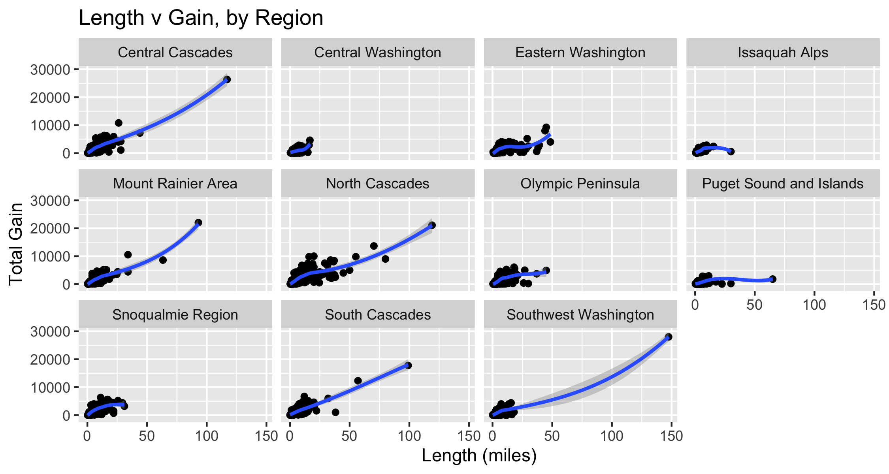

    # readin in data, create df for plots
    library(tidytuesdayR) # to load tidytuesday data
    library(tidyverse) # to do tidyverse things
    library(tidylog) # to get a log of what's happening to the data
    library(reactable) # pretty tables
    library(htmltools) # help with pretty tables
    library(RColorBrewer) # colors!
    library(scales) # format chart output
    library(lubridate) # dates!

First let’s read in the file using the tidytuesdayR package. We’ll also look at the raw data
--------------------------------------------------------------------------------------------

    #> 
    #>  Downloading file 1 of 1: `hike_data.rds`
    #> Rows: 1,958
    #> Columns: 8
    #> $ name        <chr> "Lake Hills Greenbelt", "Snow Lake", "Skookum Flats", "Te…
    #> $ location    <chr> "Puget Sound and Islands -- Seattle-Tacoma Area", "Snoqua…
    #> $ length      <chr> "2.3 miles, roundtrip", "7.2 miles, roundtrip", "7.8 mile…
    #> $ gain        <chr> "50", "1800", "300", "1585", "500", "500", "425", "450", …
    #> $ highpoint   <chr> "330.0", "4400.0", "2550.0", "2370.0", "1000.0", "2200.0"…
    #> $ rating      <chr> "3.67", "4.16", "3.68", "3.92", "4.14", "3.14", "5.00", "…
    #> $ features    <list> [<"Dogs allowed on leash", "Wildlife", "Good for kids", …
    #> $ description <chr> "Hike through a pastoral area first settled and farmed in…

### There are a few things we want to do with the data for the working dataframe:

-   create columns for miles, direction, type from length
-   create specific location columns frolm location
-   change rating, gain and highpoint to numeric
-   create a rating group
-   separate out features and make the resulting df long. we’ll use
    distinct when we only need 1 obs per trail

<!-- -->

    #> mutate: new variable 'length_miles' (double) with 277 unique values and 0% NA
    #> mutate: converted 'gain' from character to double (0 new NA)
    #>         converted 'highpoint' from character to double (0 new NA)
    #>         converted 'rating' from character to double (0 new NA)
    #> mutate: new variable 'rating_grp' (character) with 6 unique values and 0% NA
    #> mutate: new variable 'trail_type' (character) with 3 unique values and 0% NA
    #> mutate: new variable 'location_split' (character) with 61 unique values and 0% NA
    #> Warning: Expected 2 pieces. Missing pieces filled with `NA` in 38 rows [34, 73,
    #> 271, 306, 537, 559, 599, 652, 672, 708, 718, 749, 799, 800, 835, 836, 889, 1014,
    #> 1033, 1100, ...].
    #> mutate: new variable 'feature_init' (character) with 15 unique values and 0% NA
    #> mutate: new variable 'feature_type' (character) with 2 unique values and 0% NA
    #> select: columns reordered (name, location_region, location_specific, trail_type, length_miles, …)

### To get a sense of what the data look like, I’ll run a few scatterplots to see how things cluster, if there are

### outliers, etc…

    #> `geom_smooth()` using method = 'gam' and formula 'y ~ s(x, bs = "cs")'

    #> `geom_smooth()` using method = 'gam' and formula 'y ~ s(x, bs = "cs")'

