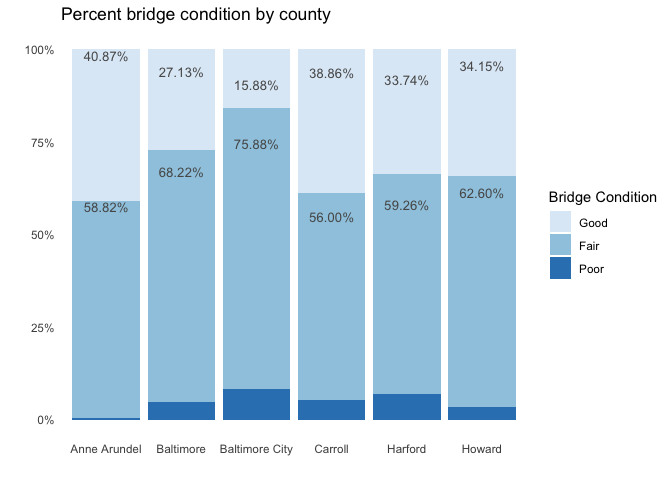
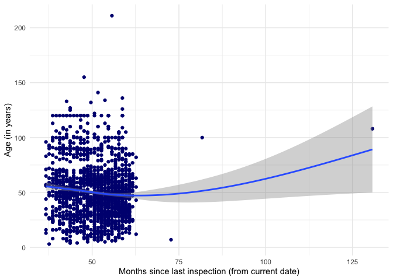

    # readin in data, create df for plots
    library(tidytuesdayR) # to load tidytuesday data
    library(tidyverse) # to do tidyverse things
    library(tidylog) # to get a log of what's happening to the data
    library(patchwork) # stitch plots together
    library(gt) # lets make tables
    library(RColorBrewer) # colors!
    library(scales) # format chart output

### First let’s read in the file using the tidytuesdayR package. We’ll also look at the raw data

    tt_watrail <- tt_load("2020-11-24")
    #> 
    #>  Downloading file 1 of 1: `hike_data.rds`

    glimpse(tt_watrail$hike_data)
    #> Rows: 1,958
    #> Columns: 8
    #> $ name        <chr> "Lake Hills Greenbelt", "Snow Lake", "Skookum Flats", "Te…
    #> $ location    <chr> "Puget Sound and Islands -- Seattle-Tacoma Area", "Snoqua…
    #> $ length      <chr> "2.3 miles, roundtrip", "7.2 miles, roundtrip", "7.8 mile…
    #> $ gain        <chr> "50", "1800", "300", "1585", "500", "500", "425", "450", …
    #> $ highpoint   <chr> "330.0", "4400.0", "2550.0", "2370.0", "1000.0", "2200.0"…
    #> $ rating      <chr> "3.67", "4.16", "3.68", "3.92", "4.14", "3.14", "5.00", "…
    #> $ features    <list> [<"Dogs allowed on leash", "Wildlife", "Good for kids", …
    #> $ description <chr> "Hike through a pastoral area first settled and farmed in…

### There are a few things we want to do with the data for the working dataframe:

-   create columns for miles, direction, type from length
-   create specific location columns frolm location
-   change rating, gain and highpoint to numeric
-   create a rating group
-   change features to character vector, also unnest; makes the
    resulting df long. we’ll use distinct when we only need 1 obs per
    trail

<!-- -->

    tt_watraildf <- tt_watrail$hike_data %>%
      mutate(length_miles = parse_number(length)) %>%
      mutate(across(gain:rating, as.numeric)) %>%
      mutate(rating_grp = case_when(rating == 0 ~ "0",
                                    rating >0 & rating < 2 ~ "1",
                                    rating >=2 & rating < 3 ~ "2",
                                    rating >=3 & rating < 4 ~ "3",
                                    rating >=4 & rating < 5 ~ "4",
                                    rating == 5 ~ "5")) %>%
      mutate(trail_type = case_when(grepl("roundtrip", length) ~ "Round trip",
                              grepl("one-way", length) ~ "One Way",
                              grepl("of trails", length) ~ "Trails")) %>% 
      mutate(location_split = location) %>%
      separate(location_split, c("location_region","location_specific"), sep = ' -- ') %>%
      mutate(features = lapply(features, sort, na.last = TRUE)) %>%
      mutate(feature_v = sapply(features,FUN = function(x) if (all(is.na(x))) NA else paste(x,collapse = ", "))) %>%
      mutate(feature_v = str_trim(feature_v)) %>%
      mutate(features_unnest = features) %>%
      unnest(cols = c(features_unnest), keep_empty = TRUE) %>% 
      mutate(feature_v = ifelse(is.na(feature_v), "none", feature_v)) %>%
      mutate(features_unnest = ifelse(is.na(features_unnest), "none", features_unnest)) %>%
      mutate(feature_init = case_when(features_unnest == "Dogs allowed on leash" ~ "DA",
                                      features_unnest == "Dogs not allowed" ~ "DN",
                                      features_unnest == "Wildlife" ~ "Wl",
                                      features_unnest == "Good for kids" ~ "GK",
                                      features_unnest == "Lakes" ~ "Lk",
                                      features_unnest == "Fall foliage" ~ "FF",
                                      features_unnest == "Ridges/passes" ~ "RP",
                                      features_unnest == "Established campsites" ~ "EC",
                                      features_unnest == "Mountain views" ~ "MV",
                                      features_unnest == "Old growth" ~ "OG",
                                      features_unnest == "Waterfalls" ~ "Wf",
                                      features_unnest == "Wildflowers/Meadows" ~ "WM",
                                      features_unnest == "Rivers" ~ "Ri",
                                      features_unnest == "Coast" ~ "Co",
                                      features_unnest == "Summits" ~ "Su")) %>%
      mutate(feature_init = ifelse(is.na(feature_init), "none", feature_init)) %>%
      mutate(feature_type = if_else(feature_init %in% c("DA","DN","GK"), "Companion", "Feature")) %>%
      mutate(feature_type = ifelse(feature_init == "none", "none", feature_type)) %>%
      group_by(name) %>%
      mutate(feature_n = n()) %>%
      ungroup() %>%
      mutate(feature_n = ifelse(feature_init == "none", 0, feature_n)) %>%
      select(name, location_region, location_specific, trail_type, length_miles, 
             gain, highpoint, rating, rating_grp, features, feature_v, features_unnest, 
             feature_init, feature_type, feature_n, description, location, length)

### To get a sense of what the data look like, I’ll run some historgrams and scatterplots to see how things cluster, if there are outliers or anything else especially noticable.

Using log10 for the length scale to even out the spread.
[Patchwork](https://patchwork.data-imaginist.com/) stitches the plots
together in a neat panel.

    hist_length <-
    tt_watraildf %>%
      distinct(name, .keep_all = TRUE) %>%
      ggplot(aes(length_miles)) +
      geom_histogram(alpha = 0.8) +
      scale_x_log10() +
      labs(x = "Length (miles), log10")

    hist_gain <-
      tt_watraildf %>%
      distinct(name, .keep_all = TRUE) %>%
      ggplot(aes(gain)) +
      geom_histogram(alpha = 0.8) +
      scale_x_log10()

    hist_high <-
      tt_watraildf %>%
      distinct(name, .keep_all = TRUE) %>%
      ggplot(aes(highpoint)) +
      geom_histogram(alpha = 0.8) 

    hist_rate <-
      tt_watraildf %>%
      distinct(name, .keep_all = TRUE) %>%
      ggplot(aes(rating)) +
      geom_histogram(alpha = 0.8) 

    (hist_length | hist_gain) /
      (hist_high | hist_rate)

 For the
scatterplots, I plotted length by gain, faceting by ratings groups and
then by region. We do have to be careful with ratings, as they are
user-generated and some trails have very few votes. Log10 used again for
length.

    tt_watraildf %>%
      distinct(name, .keep_all = TRUE) %>%
      ggplot(aes(length_miles, gain)) +
      geom_point() +
      geom_smooth() +
      scale_x_log10() +
      labs(x = "Length (miles) log10", y = "Total Gain",
           title = "Length v Gain, by Rating Group") +
      facet_wrap(vars(rating_grp))

    tt_watraildf %>%
      distinct(name, .keep_all = TRUE) %>%
      ggplot(aes(length_miles, gain)) +
      geom_point() +
      geom_smooth() +
      scale_x_log10() +
      labs(x = "Length (miles) log 10", y = "Total Gain",
           title = "Length v Gain, by Region") +
      facet_wrap(vars(location_region))

The outliers in terms of gain & length clustered in a few regions, so I
wanted to see which they were. Not a surprise they clustered in the
Cascades & Rainier.

    tt_watraildf %>%
      distinct(name, .keep_all = TRUE) %>%
      filter(gain > 15000) %>%
      filter(length_miles > 90) %>%
      select(location_region, name, length_miles, gain) %>%
      arrange(name) 
    #> # A tibble: 5 x 4
    #>   location_region    name                                     length_miles  gain
    #>   <chr>              <chr>                                           <dbl> <dbl>
    #> 1 Southwest Washing… Pacific Crest Trail (PCT) Section H - B…         148. 27996
    #> 2 South Cascades     Pacific Crest Trail (PCT) Section I - W…          99  17771
    #> 3 Central Cascades   Pacific Crest Trail (PCT) Section K - S…         117  26351
    #> 4 North Cascades     Pacific Northwest Trail - Pasayten Trav…         119  21071
    #> 5 Mount Rainier Area Wonderland Trail                                  93  22000

### Now that we see how the length, gain, highpoint & ratings spread out, I want build a table to see the averages by region.

I’ve been wanting to take a deeper dive into
[gt](https://gt.rstudio.com/) &
[reactable](https://glin.github.io/reactable/). Since I’m doing this as
a markdown doc & not HTML, I’ll output using gt here. I’ve got some
basic gt calls down, this excercise is all about conditionally
formatting columns based on value. So inspired by [Thomas Mock’s gt
primer](https://themockup.blog/posts/2020-05-16-gt-a-grammer-of-tables),
a basic table with heatmap-like formatting for some columns. See his
explainer for details on the code, and for more features than I’m
including.

    # create by region averages df
    byregion <-  tt_watraildf %>%
      distinct(name, .keep_all = TRUE) %>%
      group_by(location_region) %>%
      summarise(n_region = n(),
                avglength = mean(length_miles),
                avgrating = mean(rating),
                avggain = mean(gain),
                avghigh = mean(highpoint),
                minhigh = min(highpoint),
                maxhigh = max(highpoint)) %>%
      mutate_at(vars(avglength:avgrating), round, 2) %>%
      mutate_at(vars(avggain:avghigh), round, 0) 

    # create table - code commented out so html doesn't show up in md output. 
    # image saved from tt_20201124_watrails.r code
    # byregion %>%
    #   gt() %>%
    #   fmt_number(columns = vars(avggain, avghigh, minhigh, maxhigh), decimals = 0, use_seps = TRUE) %>%
      # sets the columns and palette to format cell color by value range
      # data_color(
      #   columns = vars(avglength, avgrating, avggain, avghigh, minhigh, maxhigh),
      #   colors = scales::col_numeric(
      #     palette = c("#ffffff", "#f2fbd2", "#c9ecb4", "#93d3ab", "#35b0ab"),
      #     domain = NULL)) %>%
      # tab_style calls add border boxes first to column labels, then body cells
      # tab_style(
      #   style = list(
      #     cell_borders(
      #       sides = "all", color = "grey", weight = px(1))),
      #   locations = list(
      #     cells_column_labels(
      #       columns = gt::everything()
      #       ))) %>%
      # tab_style(
      #   style = list(
      #     cell_borders(
      #       sides = "all", color = "grey", weight = px(1))),
      #   locations = list(
      #     cells_body(
      #       rows = gt::everything()
      #     ))) %>%
      #   cols_align(columns = TRUE, align = "center") %>%
      # cols_align(columns = "location_region", align = "left") %>%
      # tab_header(title = "Regional Averages",
      #            subtitle = md("_North Cascades have longest trails, 
      #                          all mountain areas have lots of gain and highest points_")) %>%
    #  cols_label(location_region = "Region", n_region = "N", avglength = "Avg Length (miles)",
    #            avgrating = "Avg Rating", avggain = "Avg Gain (ft)",avghigh = "Avg Highpoint",
    #             minhigh = "Lowest high point", maxhigh = "Max high point")

### Now let’s look at the effect of trail features on rating.

First we’ll look at average rating by feature, then fit a model. First,
a scatter-plot of number of features listed for a trail with user
rating. Looks like at a certain point, it’s diminshing returns on trail
features in terms of effect on rating.

    tt_watraildf %>%
      distinct(name, .keep_all = TRUE) %>%
      ggplot(aes(feature_n, rating)) +
      geom_point() +
      geom_smooth() +
      labs(x = "# of features on a trail", y = "User rating",
           title = "Features and Rating by Trail Region") +
      facet_wrap(vars(location_region))

Here’s a table similar to the one for averages by region. I used the
unnested features, so trails will be represented more than once. While
dog-free trails do get the highest ratings, it’s likely because they’re
the highest, so offer views and challenge and get good ratings.

### And finally a quick model to see what might affect a trail rating.

It’s a simple linear model using length, gain, highpoint, & number of
features to predict rating. The elevation of the highest point and
number of features are both significant. I’d need to do more digging to
see what the power of the estimate is on the rating. It’s also slightly
counter-intuitive given that we saw in the charts that length, elevation
and gain seem to positively affect rating. But then the model only
accounts for 4% of varaince, so it’s not telling us much.

    # creat df with distinct observations for each trail 
    tt_watraildf_dist <- tt_watraildf %>%
      distinct(name, .keep_all = TRUE) 

    wtmodel1 <- lm(rating ~ length_miles + gain + highpoint + feature_n, data = tt_watraildf_dist)
    summary(wtmodel1)
    #> 
    #> Call:
    #> lm(formula = rating ~ length_miles + gain + highpoint + feature_n, 
    #>     data = tt_watraildf_dist)
    #> 
    #> Residuals:
    #>     Min      1Q  Median      3Q     Max 
    #> -3.6984 -0.3776  0.3716  0.9284  2.4565 
    #> 
    #> Coefficients:
    #>                Estimate Std. Error t value Pr(>|t|)    
    #> (Intercept)   2.205e+00  8.942e-02  24.663  < 2e-16 ***
    #> length_miles -6.565e-03  5.678e-03  -1.156    0.248    
    #> gain         -3.590e-05  3.100e-05  -1.158    0.247    
    #> highpoint     8.318e-05  1.742e-05   4.775 1.93e-06 ***
    #> feature_n     1.272e-01  1.484e-02   8.576  < 2e-16 ***
    #> ---
    #> Signif. codes:  0 '***' 0.001 '**' 0.01 '*' 0.05 '.' 0.1 ' ' 1
    #> 
    #> Residual standard error: 1.398 on 1919 degrees of freedom
    #> Multiple R-squared:  0.0488, Adjusted R-squared:  0.04682 
    #> F-statistic: 24.61 on 4 and 1919 DF,  p-value: < 2.2e-16

Plenty more to do with the set, and some responses I’ve seen have been
creative…network graphs, better models…but I was able to brush up on gt,
learned how to unnest and keep obs where the list was empty. So a
successful \#tudytuesday
