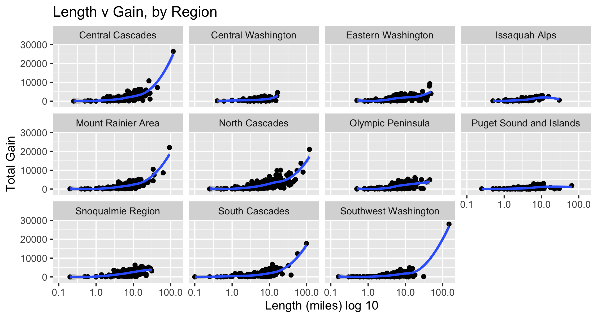

    # readin in data, create df for plots
    library(tidytuesdayR) # to load tidytuesday data
    library(tidyverse) # to do tidyverse things
    library(tidylog) # to get a log of what's happening to the data
    library(patchwork) # stitch plots together
    library(gt) # lets make tables
    library(RColorBrewer) # colors!
    library(scales) # format chart output

### First let’s read in the file using the tidytuesdayR package. We’ll also look at the raw data

    #> 
    #>  Downloading file 1 of 1: `hike_data.rds`
    #> Rows: 1,958
    #> Columns: 8
    #> $ name        <chr> "Lake Hills Greenbelt", "Snow Lake", "Skookum Flats", "Te…
    #> $ location    <chr> "Puget Sound and Islands -- Seattle-Tacoma Area", "Snoqua…
    #> $ length      <chr> "2.3 miles, roundtrip", "7.2 miles, roundtrip", "7.8 mile…
    #> $ gain        <chr> "50", "1800", "300", "1585", "500", "500", "425", "450", …
    #> $ highpoint   <chr> "330.0", "4400.0", "2550.0", "2370.0", "1000.0", "2200.0"…
    #> $ rating      <chr> "3.67", "4.16", "3.68", "3.92", "4.14", "3.14", "5.00", "…
    #> $ features    <list> [<"Dogs allowed on leash", "Wildlife", "Good for kids", …
    #> $ description <chr> "Hike through a pastoral area first settled and farmed in…

### There are a few things we want to do with the data for the working dataframe:

-   create columns for miles, direction, type from length
-   create specific location columns frolm location
-   change rating, gain and highpoint to numeric
-   create a rating group
-   separate out features and make the resulting df long. we’ll use
    distinct when we only need 1 obs per trail

<!-- -->

    #> mutate: new variable 'length_miles' (double) with 277 unique values and 0% NA
    #> mutate: converted 'gain' from character to double (0 new NA)
    #>         converted 'highpoint' from character to double (0 new NA)
    #>         converted 'rating' from character to double (0 new NA)
    #> mutate: new variable 'rating_grp' (character) with 6 unique values and 0% NA
    #> mutate: new variable 'trail_type' (character) with 3 unique values and 0% NA
    #> mutate: new variable 'location_split' (character) with 61 unique values and 0% NA
    #> Warning: Expected 2 pieces. Missing pieces filled with `NA` in 38 rows [34, 73,
    #> 271, 306, 537, 559, 599, 652, 672, 708, 718, 749, 799, 800, 835, 836, 889, 1014,
    #> 1033, 1100, ...].
    #> mutate: new variable 'feature_init' (character) with 15 unique values and 0% NA
    #> mutate: new variable 'feature_type' (character) with 2 unique values and 0% NA
    #> select: columns reordered (name, location_region, location_specific, trail_type, length_miles, …)

### To get a sense of what the data look like, I’ll run some historgrams and scatterplots to see how things cluster, if there are outliers or anything else especially noticable.

Using log10 for the length scale to even out the spread.
[Patchwork](https://patchwork.data-imaginist.com/) stitches the plots
together in a neat panel.
 For the
scatterplots, I plotted length by gain, faceting by ratings groups and
then by region. We do have to be careful with ratings, as they are
user-generated and some trails have very few votes. Log10 used again for
length.

The outliers in terms of gain & length clustered in a few regions, so I
wanted to see which they were. Not a surprise they clustered in the
Cascades & Rainier.

    #> # A tibble: 5 x 4
    #>   location_region    name                                     length_miles  gain
    #>   <chr>              <chr>                                           <dbl> <dbl>
    #> 1 Southwest Washing… Pacific Crest Trail (PCT) Section H - B…         148. 27996
    #> 2 South Cascades     Pacific Crest Trail (PCT) Section I - W…          99  17771
    #> 3 Central Cascades   Pacific Crest Trail (PCT) Section K - S…         117  26351
    #> 4 North Cascades     Pacific Northwest Trail - Pasayten Trav…         119  21071
    #> 5 Mount Rainier Area Wonderland Trail                                  93  22000

### Now that we see how the length, gain, highpoint & ratings spread out, I want build a table to see the averages by region.

I’ve been wanting to take a deeper dive into
[gt](https://gt.rstudio.com/) &
[reactable](https://glin.github.io/reactable/). Since I’m doing this as
a markdown doc & not HTML, I’ll output using gt here. I’ve got some
basic gt calls down, this excercise is all about conditionally
formatting columns based on value. So inspired by [Thomas Mock’s gt
primer](https://themockup.blog/posts/2020-05-16-gt-a-grammer-of-tables),
a basic table with heatmap-like formatting for some columns. See his
explainer for details on the code, and for more features than I’m
including. <!--html_preserve-->

<table class="gt_table">
<thead class="gt_header">
<tr>
<th colspan="8" class="gt_heading gt_title gt_font_normal" style>
Regional Averages
</th>
</tr>
<tr>
<th colspan="8" class="gt_heading gt_subtitle gt_font_normal gt_bottom_border" style>
<em>North Cascades have longest trails, all mountain areas have lots of
gain and highest points</em>
</th>
</tr>
</thead>
<thead class="gt_col_headings">
<tr>
<th class="gt_col_heading gt_columns_bottom_border gt_left" rowspan="1" colspan="1" style="border-left-width: 1px; border-left-style: solid; border-left-color: grey; border-right-width: 1px; border-right-style: solid; border-right-color: grey; border-top-width: 1px; border-top-style: solid; border-top-color: grey; border-bottom-width: 1px; border-bottom-style: solid; border-bottom-color: grey;">
Region
</th>
<th class="gt_col_heading gt_columns_bottom_border gt_center" rowspan="1" colspan="1" style="border-left-width: 1px; border-left-style: solid; border-left-color: grey; border-right-width: 1px; border-right-style: solid; border-right-color: grey; border-top-width: 1px; border-top-style: solid; border-top-color: grey; border-bottom-width: 1px; border-bottom-style: solid; border-bottom-color: grey;">
N
</th>
<th class="gt_col_heading gt_columns_bottom_border gt_center" rowspan="1" colspan="1" style="border-left-width: 1px; border-left-style: solid; border-left-color: grey; border-right-width: 1px; border-right-style: solid; border-right-color: grey; border-top-width: 1px; border-top-style: solid; border-top-color: grey; border-bottom-width: 1px; border-bottom-style: solid; border-bottom-color: grey;">
Avg Length (miles)
</th>
<th class="gt_col_heading gt_columns_bottom_border gt_center" rowspan="1" colspan="1" style="border-left-width: 1px; border-left-style: solid; border-left-color: grey; border-right-width: 1px; border-right-style: solid; border-right-color: grey; border-top-width: 1px; border-top-style: solid; border-top-color: grey; border-bottom-width: 1px; border-bottom-style: solid; border-bottom-color: grey;">
Avg Rating
</th>
<th class="gt_col_heading gt_columns_bottom_border gt_center" rowspan="1" colspan="1" style="border-left-width: 1px; border-left-style: solid; border-left-color: grey; border-right-width: 1px; border-right-style: solid; border-right-color: grey; border-top-width: 1px; border-top-style: solid; border-top-color: grey; border-bottom-width: 1px; border-bottom-style: solid; border-bottom-color: grey;">
Avg Gain (ft)
</th>
<th class="gt_col_heading gt_columns_bottom_border gt_center" rowspan="1" colspan="1" style="border-left-width: 1px; border-left-style: solid; border-left-color: grey; border-right-width: 1px; border-right-style: solid; border-right-color: grey; border-top-width: 1px; border-top-style: solid; border-top-color: grey; border-bottom-width: 1px; border-bottom-style: solid; border-bottom-color: grey;">
Avg Highpoint
</th>
<th class="gt_col_heading gt_columns_bottom_border gt_center" rowspan="1" colspan="1" style="border-left-width: 1px; border-left-style: solid; border-left-color: grey; border-right-width: 1px; border-right-style: solid; border-right-color: grey; border-top-width: 1px; border-top-style: solid; border-top-color: grey; border-bottom-width: 1px; border-bottom-style: solid; border-bottom-color: grey;">
Lowest high point
</th>
<th class="gt_col_heading gt_columns_bottom_border gt_center" rowspan="1" colspan="1" style="border-left-width: 1px; border-left-style: solid; border-left-color: grey; border-right-width: 1px; border-right-style: solid; border-right-color: grey; border-top-width: 1px; border-top-style: solid; border-top-color: grey; border-bottom-width: 1px; border-bottom-style: solid; border-bottom-color: grey;">
Max high point
</th>
</tr>
</thead>
<tbody class="gt_table_body">
<tr>
<td class="gt_row gt_left" style="border-left-width: 1px; border-left-style: solid; border-left-color: grey; border-right-width: 1px; border-right-style: solid; border-right-color: grey; border-top-width: 1px; border-top-style: solid; border-top-color: grey; border-bottom-width: 1px; border-bottom-style: solid; border-bottom-color: grey;">
Central Cascades
</td>
<td class="gt_row gt_center" style="border-left-width: 1px; border-left-style: solid; border-left-color: grey; border-right-width: 1px; border-right-style: solid; border-right-color: grey; border-top-width: 1px; border-top-style: solid; border-top-color: grey; border-bottom-width: 1px; border-bottom-style: solid; border-bottom-color: grey;">
217
</td>
<td class="gt_row gt_center" style="background-color: #95D4AB; color: #000000; border-left-width: 1px; border-left-style: solid; border-left-color: grey; border-right-width: 1px; border-right-style: solid; border-right-color: grey; border-top-width: 1px; border-top-style: solid; border-top-color: grey; border-bottom-width: 1px; border-bottom-style: solid; border-bottom-color: grey;">
9.58
</td>
<td class="gt_row gt_center" style="background-color: #9CD7AC; color: #000000; border-left-width: 1px; border-left-style: solid; border-left-color: grey; border-right-width: 1px; border-right-style: solid; border-right-color: grey; border-top-width: 1px; border-top-style: solid; border-top-color: grey; border-bottom-width: 1px; border-bottom-style: solid; border-bottom-color: grey;">
3.04
</td>
<td class="gt_row gt_center" style="background-color: #6BC1AB; color: #000000; border-left-width: 1px; border-left-style: solid; border-left-color: grey; border-right-width: 1px; border-right-style: solid; border-right-color: grey; border-top-width: 1px; border-top-style: solid; border-top-color: grey; border-bottom-width: 1px; border-bottom-style: solid; border-bottom-color: grey;">
2,277
</td>
<td class="gt_row gt_center" style="background-color: #64BEAB; color: #000000; border-left-width: 1px; border-left-style: solid; border-left-color: grey; border-right-width: 1px; border-right-style: solid; border-right-color: grey; border-top-width: 1px; border-top-style: solid; border-top-color: grey; border-bottom-width: 1px; border-bottom-style: solid; border-bottom-color: grey;">
4,750
</td>
<td class="gt_row gt_center" style="background-color: #AADDAF; color: #000000; border-left-width: 1px; border-left-style: solid; border-left-color: grey; border-right-width: 1px; border-right-style: solid; border-right-color: grey; border-top-width: 1px; border-top-style: solid; border-top-color: grey; border-bottom-width: 1px; border-bottom-style: solid; border-bottom-color: grey;">
600
</td>
<td class="gt_row gt_center" style="background-color: #9DD8AD; color: #000000; border-left-width: 1px; border-left-style: solid; border-left-color: grey; border-right-width: 1px; border-right-style: solid; border-right-color: grey; border-top-width: 1px; border-top-style: solid; border-top-color: grey; border-bottom-width: 1px; border-bottom-style: solid; border-bottom-color: grey;">
9,511
</td>
</tr>
<tr>
<td class="gt_row gt_left" style="border-left-width: 1px; border-left-style: solid; border-left-color: grey; border-right-width: 1px; border-right-style: solid; border-right-color: grey; border-top-width: 1px; border-top-style: solid; border-top-color: grey; border-bottom-width: 1px; border-bottom-style: solid; border-bottom-color: grey;">
Central Washington
</td>
<td class="gt_row gt_center" style="border-left-width: 1px; border-left-style: solid; border-left-color: grey; border-right-width: 1px; border-right-style: solid; border-right-color: grey; border-top-width: 1px; border-top-style: solid; border-top-color: grey; border-bottom-width: 1px; border-bottom-style: solid; border-bottom-color: grey;">
77
</td>
<td class="gt_row gt_center" style="background-color: #F5FCDB; color: #000000; border-left-width: 1px; border-left-style: solid; border-left-color: grey; border-right-width: 1px; border-right-style: solid; border-right-color: grey; border-top-width: 1px; border-top-style: solid; border-top-color: grey; border-bottom-width: 1px; border-bottom-style: solid; border-bottom-color: grey;">
5.71
</td>
<td class="gt_row gt_center" style="background-color: #C5EAB3; color: #000000; border-left-width: 1px; border-left-style: solid; border-left-color: grey; border-right-width: 1px; border-right-style: solid; border-right-color: grey; border-top-width: 1px; border-top-style: solid; border-top-color: grey; border-bottom-width: 1px; border-bottom-style: solid; border-bottom-color: grey;">
2.82
</td>
<td class="gt_row gt_center" style="background-color: #F6FCE0; color: #000000; border-left-width: 1px; border-left-style: solid; border-left-color: grey; border-right-width: 1px; border-right-style: solid; border-right-color: grey; border-top-width: 1px; border-top-style: solid; border-top-color: grey; border-bottom-width: 1px; border-bottom-style: solid; border-bottom-color: grey;">
809
</td>
<td class="gt_row gt_center" style="background-color: #E0F4C5; color: #000000; border-left-width: 1px; border-left-style: solid; border-left-color: grey; border-right-width: 1px; border-right-style: solid; border-right-color: grey; border-top-width: 1px; border-top-style: solid; border-top-color: grey; border-bottom-width: 1px; border-bottom-style: solid; border-bottom-color: grey;">
2,249
</td>
<td class="gt_row gt_center" style="background-color: #F2FBD2; color: #000000; border-left-width: 1px; border-left-style: solid; border-left-color: grey; border-right-width: 1px; border-right-style: solid; border-right-color: grey; border-top-width: 1px; border-top-style: solid; border-top-color: grey; border-bottom-width: 1px; border-bottom-style: solid; border-bottom-color: grey;">
240
</td>
<td class="gt_row gt_center" style="background-color: #D6F1BD; color: #000000; border-left-width: 1px; border-left-style: solid; border-left-color: grey; border-right-width: 1px; border-right-style: solid; border-right-color: grey; border-top-width: 1px; border-top-style: solid; border-top-color: grey; border-bottom-width: 1px; border-bottom-style: solid; border-bottom-color: grey;">
6,876
</td>
</tr>
<tr>
<td class="gt_row gt_left" style="border-left-width: 1px; border-left-style: solid; border-left-color: grey; border-right-width: 1px; border-right-style: solid; border-right-color: grey; border-top-width: 1px; border-top-style: solid; border-top-color: grey; border-bottom-width: 1px; border-bottom-style: solid; border-bottom-color: grey;">
Eastern Washington
</td>
<td class="gt_row gt_center" style="border-left-width: 1px; border-left-style: solid; border-left-color: grey; border-right-width: 1px; border-right-style: solid; border-right-color: grey; border-top-width: 1px; border-top-style: solid; border-top-color: grey; border-bottom-width: 1px; border-bottom-style: solid; border-bottom-color: grey;">
132
</td>
<td class="gt_row gt_center" style="background-color: #91D2AB; color: #000000; border-left-width: 1px; border-left-style: solid; border-left-color: grey; border-right-width: 1px; border-right-style: solid; border-right-color: grey; border-top-width: 1px; border-top-style: solid; border-top-color: grey; border-bottom-width: 1px; border-bottom-style: solid; border-bottom-color: grey;">
9.69
</td>
<td class="gt_row gt_center" style="background-color: #FFFFFF; color: #000000; border-left-width: 1px; border-left-style: solid; border-left-color: grey; border-right-width: 1px; border-right-style: solid; border-right-color: grey; border-top-width: 1px; border-top-style: solid; border-top-color: grey; border-bottom-width: 1px; border-bottom-style: solid; border-bottom-color: grey;">
2.23
</td>
<td class="gt_row gt_center" style="background-color: #BAE5B1; color: #000000; border-left-width: 1px; border-left-style: solid; border-left-color: grey; border-right-width: 1px; border-right-style: solid; border-right-color: grey; border-top-width: 1px; border-top-style: solid; border-top-color: grey; border-bottom-width: 1px; border-bottom-style: solid; border-bottom-color: grey;">
1,644
</td>
<td class="gt_row gt_center" style="background-color: #7AC7AB; color: #000000; border-left-width: 1px; border-left-style: solid; border-left-color: grey; border-right-width: 1px; border-right-style: solid; border-right-color: grey; border-top-width: 1px; border-top-style: solid; border-top-color: grey; border-bottom-width: 1px; border-bottom-style: solid; border-bottom-color: grey;">
4,449
</td>
<td class="gt_row gt_center" style="background-color: #E7F7CA; color: #000000; border-left-width: 1px; border-left-style: solid; border-left-color: grey; border-right-width: 1px; border-right-style: solid; border-right-color: grey; border-top-width: 1px; border-top-style: solid; border-top-color: grey; border-bottom-width: 1px; border-bottom-style: solid; border-bottom-color: grey;">
300
</td>
<td class="gt_row gt_center" style="background-color: #CEEEB8; color: #000000; border-left-width: 1px; border-left-style: solid; border-left-color: grey; border-right-width: 1px; border-right-style: solid; border-right-color: grey; border-top-width: 1px; border-top-style: solid; border-top-color: grey; border-bottom-width: 1px; border-bottom-style: solid; border-bottom-color: grey;">
7,310
</td>
</tr>
<tr>
<td class="gt_row gt_left" style="border-left-width: 1px; border-left-style: solid; border-left-color: grey; border-right-width: 1px; border-right-style: solid; border-right-color: grey; border-top-width: 1px; border-top-style: solid; border-top-color: grey; border-bottom-width: 1px; border-bottom-style: solid; border-bottom-color: grey;">
Issaquah Alps
</td>
<td class="gt_row gt_center" style="border-left-width: 1px; border-left-style: solid; border-left-color: grey; border-right-width: 1px; border-right-style: solid; border-right-color: grey; border-top-width: 1px; border-top-style: solid; border-top-color: grey; border-bottom-width: 1px; border-bottom-style: solid; border-bottom-color: grey;">
74
</td>
<td class="gt_row gt_center" style="background-color: #FAFEEE; color: #000000; border-left-width: 1px; border-left-style: solid; border-left-color: grey; border-right-width: 1px; border-right-style: solid; border-right-color: grey; border-top-width: 1px; border-top-style: solid; border-top-color: grey; border-bottom-width: 1px; border-bottom-style: solid; border-bottom-color: grey;">
4.96
</td>
<td class="gt_row gt_center" style="background-color: #F1FBD1; color: #000000; border-left-width: 1px; border-left-style: solid; border-left-color: grey; border-right-width: 1px; border-right-style: solid; border-right-color: grey; border-top-width: 1px; border-top-style: solid; border-top-color: grey; border-bottom-width: 1px; border-bottom-style: solid; border-bottom-color: grey;">
2.52
</td>
<td class="gt_row gt_center" style="background-color: #F3FBD4; color: #000000; border-left-width: 1px; border-left-style: solid; border-left-color: grey; border-right-width: 1px; border-right-style: solid; border-right-color: grey; border-top-width: 1px; border-top-style: solid; border-top-color: grey; border-bottom-width: 1px; border-bottom-style: solid; border-bottom-color: grey;">
954
</td>
<td class="gt_row gt_center" style="background-color: #F5FCDB; color: #000000; border-left-width: 1px; border-left-style: solid; border-left-color: grey; border-right-width: 1px; border-right-style: solid; border-right-color: grey; border-top-width: 1px; border-top-style: solid; border-top-color: grey; border-bottom-width: 1px; border-bottom-style: solid; border-bottom-color: grey;">
1,489
</td>
<td class="gt_row gt_center" style="background-color: #F0FAD0; color: #000000; border-left-width: 1px; border-left-style: solid; border-left-color: grey; border-right-width: 1px; border-right-style: solid; border-right-color: grey; border-top-width: 1px; border-top-style: solid; border-top-color: grey; border-bottom-width: 1px; border-bottom-style: solid; border-bottom-color: grey;">
250
</td>
<td class="gt_row gt_center" style="background-color: #FFFFFF; color: #000000; border-left-width: 1px; border-left-style: solid; border-left-color: grey; border-right-width: 1px; border-right-style: solid; border-right-color: grey; border-top-width: 1px; border-top-style: solid; border-top-color: grey; border-bottom-width: 1px; border-bottom-style: solid; border-bottom-color: grey;">
2,948
</td>
</tr>
<tr>
<td class="gt_row gt_left" style="border-left-width: 1px; border-left-style: solid; border-left-color: grey; border-right-width: 1px; border-right-style: solid; border-right-color: grey; border-top-width: 1px; border-top-style: solid; border-top-color: grey; border-bottom-width: 1px; border-bottom-style: solid; border-bottom-color: grey;">
Mount Rainier Area
</td>
<td class="gt_row gt_center" style="border-left-width: 1px; border-left-style: solid; border-left-color: grey; border-right-width: 1px; border-right-style: solid; border-right-color: grey; border-top-width: 1px; border-top-style: solid; border-top-color: grey; border-bottom-width: 1px; border-bottom-style: solid; border-bottom-color: grey;">
188
</td>
<td class="gt_row gt_center" style="background-color: #C2E9B3; color: #000000; border-left-width: 1px; border-left-style: solid; border-left-color: grey; border-right-width: 1px; border-right-style: solid; border-right-color: grey; border-top-width: 1px; border-top-style: solid; border-top-color: grey; border-bottom-width: 1px; border-bottom-style: solid; border-bottom-color: grey;">
8.08
</td>
<td class="gt_row gt_center" style="background-color: #35B0AB; color: #000000; border-left-width: 1px; border-left-style: solid; border-left-color: grey; border-right-width: 1px; border-right-style: solid; border-right-color: grey; border-top-width: 1px; border-top-style: solid; border-top-color: grey; border-bottom-width: 1px; border-bottom-style: solid; border-bottom-color: grey;">
3.37
</td>
<td class="gt_row gt_center" style="background-color: #A4DBAE; color: #000000; border-left-width: 1px; border-left-style: solid; border-left-color: grey; border-right-width: 1px; border-right-style: solid; border-right-color: grey; border-top-width: 1px; border-top-style: solid; border-top-color: grey; border-bottom-width: 1px; border-bottom-style: solid; border-bottom-color: grey;">
1,853
</td>
<td class="gt_row gt_center" style="background-color: #35B0AB; color: #000000; border-left-width: 1px; border-left-style: solid; border-left-color: grey; border-right-width: 1px; border-right-style: solid; border-right-color: grey; border-top-width: 1px; border-top-style: solid; border-top-color: grey; border-bottom-width: 1px; border-bottom-style: solid; border-bottom-color: grey;">
5,228
</td>
<td class="gt_row gt_center" style="background-color: #6FC3AB; color: #000000; border-left-width: 1px; border-left-style: solid; border-left-color: grey; border-right-width: 1px; border-right-style: solid; border-right-color: grey; border-top-width: 1px; border-top-style: solid; border-top-color: grey; border-bottom-width: 1px; border-bottom-style: solid; border-bottom-color: grey;">
800
</td>
<td class="gt_row gt_center" style="background-color: #8FD1AB; color: #000000; border-left-width: 1px; border-left-style: solid; border-left-color: grey; border-right-width: 1px; border-right-style: solid; border-right-color: grey; border-top-width: 1px; border-top-style: solid; border-top-color: grey; border-bottom-width: 1px; border-bottom-style: solid; border-bottom-color: grey;">
10,080
</td>
</tr>
<tr>
<td class="gt_row gt_left" style="border-left-width: 1px; border-left-style: solid; border-left-color: grey; border-right-width: 1px; border-right-style: solid; border-right-color: grey; border-top-width: 1px; border-top-style: solid; border-top-color: grey; border-bottom-width: 1px; border-bottom-style: solid; border-bottom-color: grey;">
North Cascades
</td>
<td class="gt_row gt_center" style="border-left-width: 1px; border-left-style: solid; border-left-color: grey; border-right-width: 1px; border-right-style: solid; border-right-color: grey; border-top-width: 1px; border-top-style: solid; border-top-color: grey; border-bottom-width: 1px; border-bottom-style: solid; border-bottom-color: grey;">
279
</td>
<td class="gt_row gt_center" style="background-color: #35B0AB; color: #000000; border-left-width: 1px; border-left-style: solid; border-left-color: grey; border-right-width: 1px; border-right-style: solid; border-right-color: grey; border-top-width: 1px; border-top-style: solid; border-top-color: grey; border-bottom-width: 1px; border-bottom-style: solid; border-bottom-color: grey;">
11.41
</td>
<td class="gt_row gt_center" style="background-color: #8FD1AB; color: #000000; border-left-width: 1px; border-left-style: solid; border-left-color: grey; border-right-width: 1px; border-right-style: solid; border-right-color: grey; border-top-width: 1px; border-top-style: solid; border-top-color: grey; border-bottom-width: 1px; border-bottom-style: solid; border-bottom-color: grey;">
3.10
</td>
<td class="gt_row gt_center" style="background-color: #35B0AB; color: #000000; border-left-width: 1px; border-left-style: solid; border-left-color: grey; border-right-width: 1px; border-right-style: solid; border-right-color: grey; border-top-width: 1px; border-top-style: solid; border-top-color: grey; border-bottom-width: 1px; border-bottom-style: solid; border-bottom-color: grey;">
2,534
</td>
<td class="gt_row gt_center" style="background-color: #47B4AB; color: #000000; border-left-width: 1px; border-left-style: solid; border-left-color: grey; border-right-width: 1px; border-right-style: solid; border-right-color: grey; border-top-width: 1px; border-top-style: solid; border-top-color: grey; border-bottom-width: 1px; border-bottom-style: solid; border-bottom-color: grey;">
5,077
</td>
<td class="gt_row gt_center" style="background-color: #F9FDE8; color: #000000; border-left-width: 1px; border-left-style: solid; border-left-color: grey; border-right-width: 1px; border-right-style: solid; border-right-color: grey; border-top-width: 1px; border-top-style: solid; border-top-color: grey; border-bottom-width: 1px; border-bottom-style: solid; border-bottom-color: grey;">
125
</td>
<td class="gt_row gt_center" style="background-color: #A5DBAE; color: #000000; border-left-width: 1px; border-left-style: solid; border-left-color: grey; border-right-width: 1px; border-right-style: solid; border-right-color: grey; border-top-width: 1px; border-top-style: solid; border-top-color: grey; border-bottom-width: 1px; border-bottom-style: solid; border-bottom-color: grey;">
9,200
</td>
</tr>
<tr>
<td class="gt_row gt_left" style="border-left-width: 1px; border-left-style: solid; border-left-color: grey; border-right-width: 1px; border-right-style: solid; border-right-color: grey; border-top-width: 1px; border-top-style: solid; border-top-color: grey; border-bottom-width: 1px; border-bottom-style: solid; border-bottom-color: grey;">
Olympic Peninsula
</td>
<td class="gt_row gt_center" style="border-left-width: 1px; border-left-style: solid; border-left-color: grey; border-right-width: 1px; border-right-style: solid; border-right-color: grey; border-top-width: 1px; border-top-style: solid; border-top-color: grey; border-bottom-width: 1px; border-bottom-style: solid; border-bottom-color: grey;">
203
</td>
<td class="gt_row gt_center" style="background-color: #BFE7B2; color: #000000; border-left-width: 1px; border-left-style: solid; border-left-color: grey; border-right-width: 1px; border-right-style: solid; border-right-color: grey; border-top-width: 1px; border-top-style: solid; border-top-color: grey; border-bottom-width: 1px; border-bottom-style: solid; border-bottom-color: grey;">
8.19
</td>
<td class="gt_row gt_center" style="background-color: #4CB6AB; color: #000000; border-left-width: 1px; border-left-style: solid; border-left-color: grey; border-right-width: 1px; border-right-style: solid; border-right-color: grey; border-top-width: 1px; border-top-style: solid; border-top-color: grey; border-bottom-width: 1px; border-bottom-style: solid; border-bottom-color: grey;">
3.32
</td>
<td class="gt_row gt_center" style="background-color: #C1E8B3; color: #000000; border-left-width: 1px; border-left-style: solid; border-left-color: grey; border-right-width: 1px; border-right-style: solid; border-right-color: grey; border-top-width: 1px; border-top-style: solid; border-top-color: grey; border-bottom-width: 1px; border-bottom-style: solid; border-bottom-color: grey;">
1,570
</td>
<td class="gt_row gt_center" style="background-color: #CCEDB6; color: #000000; border-left-width: 1px; border-left-style: solid; border-left-color: grey; border-right-width: 1px; border-right-style: solid; border-right-color: grey; border-top-width: 1px; border-top-style: solid; border-top-color: grey; border-bottom-width: 1px; border-bottom-style: solid; border-bottom-color: grey;">
2,825
</td>
<td class="gt_row gt_center" style="background-color: #FEFFFD; color: #000000; border-left-width: 1px; border-left-style: solid; border-left-color: grey; border-right-width: 1px; border-right-style: solid; border-right-color: grey; border-top-width: 1px; border-top-style: solid; border-top-color: grey; border-bottom-width: 1px; border-bottom-style: solid; border-bottom-color: grey;">
20
</td>
<td class="gt_row gt_center" style="background-color: #D4F0BC; color: #000000; border-left-width: 1px; border-left-style: solid; border-left-color: grey; border-right-width: 1px; border-right-style: solid; border-right-color: grey; border-top-width: 1px; border-top-style: solid; border-top-color: grey; border-bottom-width: 1px; border-bottom-style: solid; border-bottom-color: grey;">
6,988
</td>
</tr>
<tr>
<td class="gt_row gt_left" style="border-left-width: 1px; border-left-style: solid; border-left-color: grey; border-right-width: 1px; border-right-style: solid; border-right-color: grey; border-top-width: 1px; border-top-style: solid; border-top-color: grey; border-bottom-width: 1px; border-bottom-style: solid; border-bottom-color: grey;">
Puget Sound and Islands
</td>
<td class="gt_row gt_center" style="border-left-width: 1px; border-left-style: solid; border-left-color: grey; border-right-width: 1px; border-right-style: solid; border-right-color: grey; border-top-width: 1px; border-top-style: solid; border-top-color: grey; border-bottom-width: 1px; border-bottom-style: solid; border-bottom-color: grey;">
184
</td>
<td class="gt_row gt_center" style="background-color: #FFFFFF; color: #000000; border-left-width: 1px; border-left-style: solid; border-left-color: grey; border-right-width: 1px; border-right-style: solid; border-right-color: grey; border-top-width: 1px; border-top-style: solid; border-top-color: grey; border-bottom-width: 1px; border-bottom-style: solid; border-bottom-color: grey;">
4.29
</td>
<td class="gt_row gt_center" style="background-color: #C5EAB3; color: #000000; border-left-width: 1px; border-left-style: solid; border-left-color: grey; border-right-width: 1px; border-right-style: solid; border-right-color: grey; border-top-width: 1px; border-top-style: solid; border-top-color: grey; border-bottom-width: 1px; border-bottom-style: solid; border-bottom-color: grey;">
2.82
</td>
<td class="gt_row gt_center" style="background-color: #FFFFFF; color: #000000; border-left-width: 1px; border-left-style: solid; border-left-color: grey; border-right-width: 1px; border-right-style: solid; border-right-color: grey; border-top-width: 1px; border-top-style: solid; border-top-color: grey; border-bottom-width: 1px; border-bottom-style: solid; border-bottom-color: grey;">
455
</td>
<td class="gt_row gt_center" style="background-color: #FFFFFF; color: #000000; border-left-width: 1px; border-left-style: solid; border-left-color: grey; border-right-width: 1px; border-right-style: solid; border-right-color: grey; border-top-width: 1px; border-top-style: solid; border-top-color: grey; border-bottom-width: 1px; border-bottom-style: solid; border-bottom-color: grey;">
568
</td>
<td class="gt_row gt_center" style="background-color: #FFFFFF; color: #000000; border-left-width: 1px; border-left-style: solid; border-left-color: grey; border-right-width: 1px; border-right-style: solid; border-right-color: grey; border-top-width: 1px; border-top-style: solid; border-top-color: grey; border-bottom-width: 1px; border-bottom-style: solid; border-bottom-color: grey;">
10
</td>
<td class="gt_row gt_center" style="background-color: #FBFEF0; color: #000000; border-left-width: 1px; border-left-style: solid; border-left-color: grey; border-right-width: 1px; border-right-style: solid; border-right-color: grey; border-top-width: 1px; border-top-style: solid; border-top-color: grey; border-bottom-width: 1px; border-bottom-style: solid; border-bottom-color: grey;">
3,750
</td>
</tr>
<tr>
<td class="gt_row gt_left" style="border-left-width: 1px; border-left-style: solid; border-left-color: grey; border-right-width: 1px; border-right-style: solid; border-right-color: grey; border-top-width: 1px; border-top-style: solid; border-top-color: grey; border-bottom-width: 1px; border-bottom-style: solid; border-bottom-color: grey;">
Snoqualmie Region
</td>
<td class="gt_row gt_center" style="border-left-width: 1px; border-left-style: solid; border-left-color: grey; border-right-width: 1px; border-right-style: solid; border-right-color: grey; border-top-width: 1px; border-top-style: solid; border-top-color: grey; border-bottom-width: 1px; border-bottom-style: solid; border-bottom-color: grey;">
208
</td>
<td class="gt_row gt_center" style="background-color: #B1E1B0; color: #000000; border-left-width: 1px; border-left-style: solid; border-left-color: grey; border-right-width: 1px; border-right-style: solid; border-right-color: grey; border-top-width: 1px; border-top-style: solid; border-top-color: grey; border-bottom-width: 1px; border-bottom-style: solid; border-bottom-color: grey;">
8.66
</td>
<td class="gt_row gt_center" style="background-color: #6EC2AB; color: #000000; border-left-width: 1px; border-left-style: solid; border-left-color: grey; border-right-width: 1px; border-right-style: solid; border-right-color: grey; border-top-width: 1px; border-top-style: solid; border-top-color: grey; border-bottom-width: 1px; border-bottom-style: solid; border-bottom-color: grey;">
3.22
</td>
<td class="gt_row gt_center" style="background-color: #7CC8AB; color: #000000; border-left-width: 1px; border-left-style: solid; border-left-color: grey; border-right-width: 1px; border-right-style: solid; border-right-color: grey; border-top-width: 1px; border-top-style: solid; border-top-color: grey; border-bottom-width: 1px; border-bottom-style: solid; border-bottom-color: grey;">
2,171
</td>
<td class="gt_row gt_center" style="background-color: #79C7AB; color: #000000; border-left-width: 1px; border-left-style: solid; border-left-color: grey; border-right-width: 1px; border-right-style: solid; border-right-color: grey; border-top-width: 1px; border-top-style: solid; border-top-color: grey; border-bottom-width: 1px; border-bottom-style: solid; border-bottom-color: grey;">
4,457
</td>
<td class="gt_row gt_center" style="background-color: #CCEDB6; color: #000000; border-left-width: 1px; border-left-style: solid; border-left-color: grey; border-right-width: 1px; border-right-style: solid; border-right-color: grey; border-top-width: 1px; border-top-style: solid; border-top-color: grey; border-bottom-width: 1px; border-bottom-style: solid; border-bottom-color: grey;">
450
</td>
<td class="gt_row gt_center" style="background-color: #A0D9AD; color: #000000; border-left-width: 1px; border-left-style: solid; border-left-color: grey; border-right-width: 1px; border-right-style: solid; border-right-color: grey; border-top-width: 1px; border-top-style: solid; border-top-color: grey; border-bottom-width: 1px; border-bottom-style: solid; border-bottom-color: grey;">
9,416
</td>
</tr>
<tr>
<td class="gt_row gt_left" style="border-left-width: 1px; border-left-style: solid; border-left-color: grey; border-right-width: 1px; border-right-style: solid; border-right-color: grey; border-top-width: 1px; border-top-style: solid; border-top-color: grey; border-bottom-width: 1px; border-bottom-style: solid; border-bottom-color: grey;">
South Cascades
</td>
<td class="gt_row gt_center" style="border-left-width: 1px; border-left-style: solid; border-left-color: grey; border-right-width: 1px; border-right-style: solid; border-right-color: grey; border-top-width: 1px; border-top-style: solid; border-top-color: grey; border-bottom-width: 1px; border-bottom-style: solid; border-bottom-color: grey;">
181
</td>
<td class="gt_row gt_center" style="background-color: #B6E3B1; color: #000000; border-left-width: 1px; border-left-style: solid; border-left-color: grey; border-right-width: 1px; border-right-style: solid; border-right-color: grey; border-top-width: 1px; border-top-style: solid; border-top-color: grey; border-bottom-width: 1px; border-bottom-style: solid; border-bottom-color: grey;">
8.49
</td>
<td class="gt_row gt_center" style="background-color: #96D4AB; color: #000000; border-left-width: 1px; border-left-style: solid; border-left-color: grey; border-right-width: 1px; border-right-style: solid; border-right-color: grey; border-top-width: 1px; border-top-style: solid; border-top-color: grey; border-bottom-width: 1px; border-bottom-style: solid; border-bottom-color: grey;">
3.07
</td>
<td class="gt_row gt_center" style="background-color: #B8E4B1; color: #000000; border-left-width: 1px; border-left-style: solid; border-left-color: grey; border-right-width: 1px; border-right-style: solid; border-right-color: grey; border-top-width: 1px; border-top-style: solid; border-top-color: grey; border-bottom-width: 1px; border-bottom-style: solid; border-bottom-color: grey;">
1,664
</td>
<td class="gt_row gt_center" style="background-color: #62BEAB; color: #000000; border-left-width: 1px; border-left-style: solid; border-left-color: grey; border-right-width: 1px; border-right-style: solid; border-right-color: grey; border-top-width: 1px; border-top-style: solid; border-top-color: grey; border-bottom-width: 1px; border-bottom-style: solid; border-bottom-color: grey;">
4,770
</td>
<td class="gt_row gt_center" style="background-color: #35B0AB; color: #000000; border-left-width: 1px; border-left-style: solid; border-left-color: grey; border-right-width: 1px; border-right-style: solid; border-right-color: grey; border-top-width: 1px; border-top-style: solid; border-top-color: grey; border-bottom-width: 1px; border-bottom-style: solid; border-bottom-color: grey;">
922
</td>
<td class="gt_row gt_center" style="background-color: #35B0AB; color: #000000; border-left-width: 1px; border-left-style: solid; border-left-color: grey; border-right-width: 1px; border-right-style: solid; border-right-color: grey; border-top-width: 1px; border-top-style: solid; border-top-color: grey; border-bottom-width: 1px; border-bottom-style: solid; border-bottom-color: grey;">
12,276
</td>
</tr>
<tr>
<td class="gt_row gt_left" style="border-left-width: 1px; border-left-style: solid; border-left-color: grey; border-right-width: 1px; border-right-style: solid; border-right-color: grey; border-top-width: 1px; border-top-style: solid; border-top-color: grey; border-bottom-width: 1px; border-bottom-style: solid; border-bottom-color: grey;">
Southwest Washington
</td>
<td class="gt_row gt_center" style="border-left-width: 1px; border-left-style: solid; border-left-color: grey; border-right-width: 1px; border-right-style: solid; border-right-color: grey; border-top-width: 1px; border-top-style: solid; border-top-color: grey; border-bottom-width: 1px; border-bottom-style: solid; border-bottom-color: grey;">
115
</td>
<td class="gt_row gt_center" style="background-color: #EAF8CC; color: #000000; border-left-width: 1px; border-left-style: solid; border-left-color: grey; border-right-width: 1px; border-right-style: solid; border-right-color: grey; border-top-width: 1px; border-top-style: solid; border-top-color: grey; border-bottom-width: 1px; border-bottom-style: solid; border-bottom-color: grey;">
6.44
</td>
<td class="gt_row gt_center" style="background-color: #D7F1BE; color: #000000; border-left-width: 1px; border-left-style: solid; border-left-color: grey; border-right-width: 1px; border-right-style: solid; border-right-color: grey; border-top-width: 1px; border-top-style: solid; border-top-color: grey; border-bottom-width: 1px; border-bottom-style: solid; border-bottom-color: grey;">
2.70
</td>
<td class="gt_row gt_center" style="background-color: #E3F6C7; color: #000000; border-left-width: 1px; border-left-style: solid; border-left-color: grey; border-right-width: 1px; border-right-style: solid; border-right-color: grey; border-top-width: 1px; border-top-style: solid; border-top-color: grey; border-bottom-width: 1px; border-bottom-style: solid; border-bottom-color: grey;">
1,166
</td>
<td class="gt_row gt_center" style="background-color: #F1FBD1; color: #000000; border-left-width: 1px; border-left-style: solid; border-left-color: grey; border-right-width: 1px; border-right-style: solid; border-right-color: grey; border-top-width: 1px; border-top-style: solid; border-top-color: grey; border-bottom-width: 1px; border-bottom-style: solid; border-bottom-color: grey;">
1,771
</td>
<td class="gt_row gt_center" style="background-color: #FEFFFD; color: #000000; border-left-width: 1px; border-left-style: solid; border-left-color: grey; border-right-width: 1px; border-right-style: solid; border-right-color: grey; border-top-width: 1px; border-top-style: solid; border-top-color: grey; border-bottom-width: 1px; border-bottom-style: solid; border-bottom-color: grey;">
20
</td>
<td class="gt_row gt_center" style="background-color: #C5EAB3; color: #000000; border-left-width: 1px; border-left-style: solid; border-left-color: grey; border-right-width: 1px; border-right-style: solid; border-right-color: grey; border-top-width: 1px; border-top-style: solid; border-top-color: grey; border-bottom-width: 1px; border-bottom-style: solid; border-bottom-color: grey;">
7,800
</td>
</tr>
</tbody>
</table>

<!--/html_preserve-->
### And finally a couple of models to see what might affect a trail rating.

First a simple linear model using length, gain, & highpoint to predict
rating

    #> 
    #> Call:
    #> lm(formula = rating ~ length_miles + gain + highpoint, data = tt_watraildf_dist)
    #> 
    #> Residuals:
    #>     Min      1Q  Median      3Q     Max 
    #> -3.3527 -0.3735  0.3506  0.9626  2.5779 
    #> 
    #> Coefficients:
    #>                Estimate Std. Error t value Pr(>|t|)    
    #> (Intercept)   2.765e+00  6.531e-02  42.331  < 2e-16 ***
    #> length_miles  1.477e-04  5.794e-03   0.025    0.980    
    #> gain         -4.156e-05  3.191e-05  -1.303    0.193    
    #> highpoint     8.268e-05  1.785e-05   4.631 3.89e-06 ***
    #> ---
    #> Signif. codes:  0 '***' 0.001 '**' 0.01 '*' 0.05 '.' 0.1 ' ' 1
    #> 
    #> Residual standard error: 1.412 on 1854 degrees of freedom
    #> Multiple R-squared:  0.01242,    Adjusted R-squared:  0.01082 
    #> F-statistic: 7.769 on 3 and 1854 DF,  p-value: 3.723e-05
